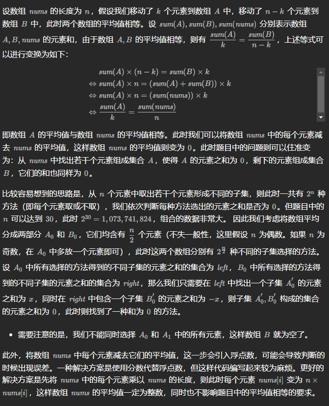

# 数组的均值分割

给定你一个整数数组$nums$

我们要将 $nums$ 数组中的每个元素移动到 $A$ 数组 或者 $B$ 数组中，使得 $A$ 数组和 $B$ 数组不为空，并且 $average(A) == average(B)$ 。

如果可以完成则返回$true$ ， 否则返回 $false$  。

**注意**：对于数组 arr ,  average(arr) 是 arr 的所有元素除以 arr 长度的和。

## 思路


## CODE
```cpp
class Solution {
public:
    bool splitArraySameAverage(vector<int>& nums) {
        
        int n = nums.size(), m = n/2, sum = accumulate(nums.begin(), nums.end(), 0);
        if(n == 1) return false;
        for(int &x : nums)//使平均数为0 且为整数
        {
            x = x*n - sum;
        }

        unordered_set<int> left;
        for(int i = 1; i < (1 << m); i++)//i表示可选择的状态
        {
            int temp = 0;
            for(int j = 0; j < m; j++)//选哪个
            {
                if(i & (1 << j))
                {
                    temp += nums[j];
                }
            }
            if(temp == 0) return true;
            left.emplace(temp);
        }

        int sumright = accumulate(nums.begin()+m, nums.end(), 0);
        for(int i = 1; i < (1 << (n-m)); i++)
        {
            int temp = 0;
            for(int j = m; j < n; j++)
            {
                if(i & (1 << (j-m)))
                {
                    temp += nums[j];
                }
            }
            if(temp == 0 || (sumright != temp && left.count(-temp))) return true;//不可全选
        }
        return false;
    }
};
```
 
​
 


