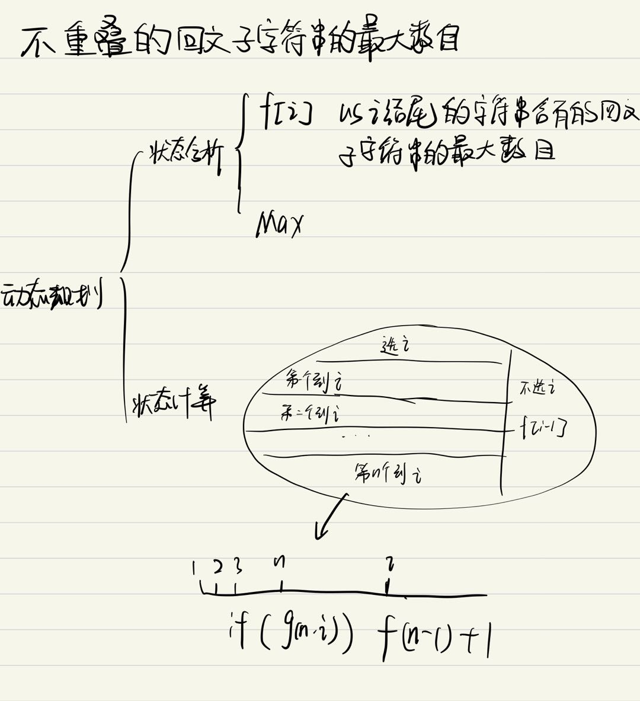

# 第319场周赛
[toc]
这场周赛会学到
1. 最小公倍数性质
2. 计算可以任意调换数组中某两个元素使之有序的两个方法
3. 闫氏dp分析法解最大不重叠子任务数

## [最小公倍数为 K 的子数组数目](https://leetcode.cn/problems/number-of-subarrays-with-lcm-equal-to-k/)
给你一个整数数组 $nums$ 和一个整数 $k$ ，请你统计并返回 $nums$ 的**子数组**中满足元素最小公倍数为 $k$ 的子数组数目。
**子数组**是数组中一个连续非空的元素序列。
**数组的最小公倍数**是可被所有数组元素整除的最小正整数

**示例 1**
>**输入**：nums = [3,6,2,7,1], k = 6</br>**输出**：4</br>**解释**：以 6 为最小公倍数的子数组是：</br>[3,6,2,7,1]</br>[3,6,2,7,1]</br>[3,6,2,7,1]</br>[3,6,2,7,1]

**示例二**
>**输入**：nums = [3], k = 2</br>**输出**：0</br>**解释**：不存在以 2 为最小公倍数的子数组。

**数据范围**
$1 <= nums.length <= 1000$

$1 <= nums[i], k <= 1000$

### 思路
**先验知识**
1. $lcm\{a,b,c,d\} = lcm\{lcm\{a,b,c\},d\}$
2. $lcm\{a,b\} * gcd\{a,b\} = a*b$
3. 最大公约数gcd 算法模板

### CODE
```cpp
class Solution {
public:
    int gcd(int a, int b)
    {
        return b ? gcd(b, a%b) : a;
    }
    int subarrayLCM(vector<int>& nums, int k) {
        int n = nums.size(), ans = 0;
        for(int i = 0; i < n; i++)
        {
            int lcm = nums[i];
            for(int j = i; j < n; j++)
            {
                lcm = lcm * nums[j] / gcd(lcm, nums[j]);
                if(lcm == k) ans++;
                else if(lcm > k) break;
            }
        }
        return ans;        
    }
};
```

## [逐层排序二叉树所需的最少操作数目](https://leetcode.cn/problems/minimum-number-of-operations-to-sort-a-binary-tree-by-level/)
给你一个值**互不相同**的二叉树的根节点 root 。
在一步操作中，你可以选择同一层上任意两个节点，交换这两个节点的值。
返回每一层按**严格递增顺序**排序所需的最少操作数目。
**节点的层数**是该节点和根节点之间的路径的边数。


**示例一**

>**输入**：root = [1,4,3,7,6,8,5,null,null,null,null,9,null,10]</br>**输出**：3</br>**解释**：交换 4 和 3 。第 2 层变为 [3,4] 。</br>交换 7 和 5 。第 3 层变为 [5,6,8,7] 。</br>交换 8 和 7 。第 3 层变为 [5,6,7,8] 。</br>共计用了 3 步操作，所以返回 3 。</br>可以证明 3 是需要的最少操作数目。

### 思路
我们把每层所有数都取出来，问题变为给一个序列，序列两两元素可以任意交换，求最少的交换次数使得序列有序。最终答案就是每层答案的和。

这是一个经典问题，一般有两种做法（详见 https://www.geeksforgeeks.org/minimum-number-swaps-required-sort-array/ ）：

1. 从 1 到 n 不断枚举下标i, 设当前序列第i个位置为ai，目标系列第i个位置为bi，若$ a_{i} $ $\neq$ $ b_{i} $, 则**不断**将$ a_{i} $交换到目标位置，直到$ a_{i} $ $=$ $ b_{i} $，交换次数就是答案。
2. 求整个序列中置换环的数量，答案就是序列长度减去置换环的数量。
复杂度  $O(nlogn)$

**<font color="#dd0000">若此题中任意两个节点条件改为相邻节点，则为求[逆序对数目](https://leetcode.cn/problems/shu-zu-zhong-de-ni-xu-dui-lcof/description/)，考虑归并排序</font><br />**

### CODE
```cpp
class Solution {
public:
//方法一
int getMinSwaps1(vector<int> &nums)
{
    int n = nums.size(), ans = 0;
    vector<int> copy = nums;
    sort(copy.begin(), copy.end());
    unordered_map<int, int> m;
    for(int i = 0; i < n; i++)
    {
        m[copy[i]]  = i;//应该在的位置
    }

    for(int i = 0; i < n; i++)
    {
        while(copy[i] != nums[i])
        {
            swap(nums[i], m[nums[i]]);
            ans++;
        }
    }
   

    return ans;
}
//环图法
int getMinSwaps2(vector<int> &nums)
{
    int n = nums.size();
    vector<int> copy = nums;
    sort(copy.begin(), copy.end());
    unordered_map<int, int> m;
    for(int i = 0; i < n; i++)
    {
        m[copy[i]]  = i;//应该在的位置
    }

    int loops = 0;
    vector<bool> findloop(n, false);
    for(int i = 0; i < n; i++)
    {
        if(!findloop[i])
        {
            int j = i;
            while(!findloop[j])
            {
                findloop[j] = true;
                j = m[nums[j]];
                
            }
            loops++;
        }
    }

    return n-loops;
}
    
    
    int minimumOperations(TreeNode* root) {
        int ans = 0;
        queue<TreeNode*> que;
        que.push(root);
        while(!que.empty())
        {
            int n = que.size();
            vector<int> temp;
            while(n--)
            {
                auto it = que.front();
                que.pop();
                temp.push_back(it->val);
                if(it->left != nullptr) que.push(it->left);
                if(it->right!= nullptr) que.push(it->right);
            }
            ans += getMinSwaps1(temp);
        }
        return ans;
    }
};
```
### [不重叠回文子字符串的最大数目](https://leetcode.cn/problems/maximum-number-of-non-overlapping-palindrome-substrings/)
给你一个字符串 $s$ 和一个正整数 $k$ 。

从字符串 $s$ 中选出一组满足下述条件且不重叠的子字符串：

每个子字符串的长度至少为 $k$ 。
每个子字符串是一个回文串 。
返回最优方案中能选择的子字符串的**最大**数目。

**子字符串** 是字符串中一个连续的字符序列。

**示例一**
>**输入**：s = "abaccdbbd", k = 3</br>**输出**：2</br>**解释**：可以选择 s = "abaccdbbd" 中斜体加粗的子字符串。"aba" 和 "dbbd" 都是回文，且长度至少为 k = 3 。</br>
可以证明，无法选出两个以上的有效子字符串。

### 思路

此题可以分解为两个子问题
1. 求出每个子串是不是回文子串。记 g(l, r)g(l,r) 表示第 l 到 r 个字符构成的子串是不是回文子串。
2. 之后维护 $f(i)$ 表示以i结尾的 $i$ 的字符串中能选出多少个长度大等于 $k$ 且不重叠的子串，转移方程见闫氏dp分析法

### CODE
```cpp
class Solution {
public:
    int maxPalindromes(string s, int k) 
    {
        int n = s.size();
        
        vector<vector<bool>> g(n + 1, vector<bool>(n + 1));
        for (int len = 1; len <= n; len ++ ) 
        {
            for (int i = 1; i + len - 1 <= n; i ++ )
            {
                int j = i + len -1;
                if(s[i-1] == s[j-1] && (len <= 2 || g[i+1][j-1])) 
                {
                    g[i][j] = true;
                }
            }
        }
          
        vector<int> f(n+1);
        for(int i = 1; i <= n; i++)
        {
            f[i] = f[i-1];
            for(int j = i-k; j >= 0; j--)
            {
                if(g[j+1][i])
                {
                    f[i] = max(f[i], f[j]+1);
                }
            }
        }
        
        return f[n];
    }
};
```

