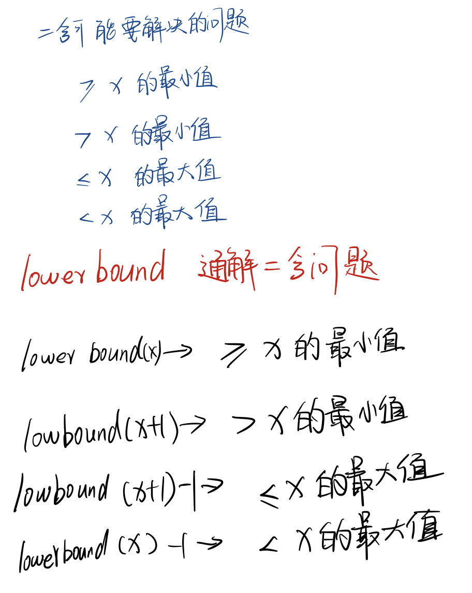
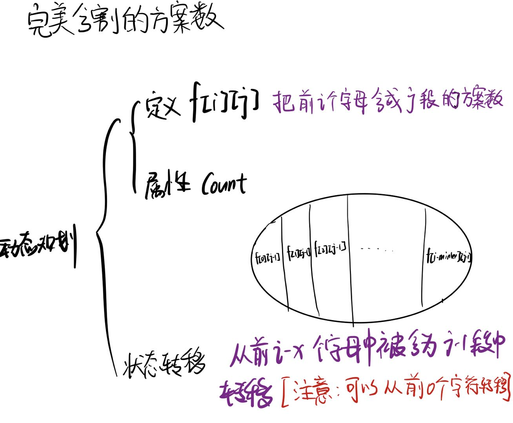

# 320周赛

## 二叉搜索树最近节点查询
给你一个 **二叉搜索树** 的根节点 $root$，和一个由正整数组成、长度为 $n$ 的数组`queries` 。

请你找出一个长度为 $n$ 的**二维**答案数组 `answer` ，其中 `answer[i]` = $[min_{i}, max_{i}]$ ：

$min_{i}$ 是树中小于等于 `queries[i]` 的 最大值 。如果不存在这样的值，则使用 -1 代替。
$max_{i}$ 是树中大于等于 queries[i] 的 最小值 。如果不存在这样的值，则使用 -1 代替。
返回数组 answer 。

### 思路

**二分查找**


二分查找写法 **【左闭右闭】**
```cpp
//寻找 >= target 最小值
lowerbound1(vector<int> &record, int target)//一定要用引用
{
    int l = 0, r = record.size()-1;// 左闭右闭
    int index = -1;//将l, r专注于区间判定，index负责记录
    while(l <= r)
    {
        int mid = l + (r-l) >> 1;
        if(record[mid] >= target)
        {
            index = mid;
            right = mid-1;//缩右边界找最小
        }
        else
        {
            left = mid + 1;
        }
    }
    return index == -1 ? index : record[index];
}

//寻找 <= target 最大值
lowerbound2(vector<int> &record, int target)//一定要用引用
{
    int l = 0, r = record.size()-1;// 左闭右闭
    int index = -1;//将l, r专注于区间判定，index负责记录
    while(l <= r)
    {
        int mid = l + (r-l) >> 1;
        if(record[mid] <= target)//目标
        {
            index = mid;
            left = mid+1;//缩左边界找最大
        }
        else
        {
            right = mid - 1;
        }
    }
    return index == -1 ? index : record[index];
}
```

### CODE
**自写二分查找**
```cpp
class Solution {
public:
    vector<int> record;
    void midrecord(TreeNode* root)
    {
        if(!root) return;
        midrecord(root->left);
        record.push_back(root->val);
        midrecord(root->right);
    }
int lowerbound1(vector<int> &record, int target)//一定要用引用
{
    int l = 0, r = record.size()-1;// 左闭右闭
    int index = -1;//将l, r专注于区间判定，index负责记录
    while(l <= r)
    {
        int mid = l + ((r-l) >> 1);
        if(record[mid] >= target)
        {
            index = mid;
            r = mid-1;//缩右边界找最小
        }
        else
        {
            l = mid + 1;
        }
    }
    return index == -1 ? index : record[index];
}

//寻找 <= target 最大值
int lowerbound2(vector<int> &record, int target)//一定要用引用
{
    int l = 0, r = record.size()-1;// 左闭右闭
    int index = -1;//将l, r专注于区间判定，index负责记录
    while(l <= r)
    {
        int mid = l + ((r-l) >> 1);
        if(record[mid] <= target)//目标
        {
            index = mid;
            l = mid+1;//缩左边界找最大
        }
        else
        {
            r = mid - 1;
        }
    }
    return index == -1 ? index : record[index];
}
    vector<vector<int>> closestNodes(TreeNode* root, vector<int>& queries) {
        vector<vector<int>> ans;
        if(!root) return ans;
        int n = queries.size();
        midrecord(root);
        for(int i = 0; i < n; i++)
        {
            int ans1 = -1, ans2 = -1;
            ans1 = lowerbound2(record, queries[i]);
            ans2 = lowerbound1(record, queries[i]);
            ans.push_back({ans1, ans2});
        }
        return ans;
    }
};
```
**利用思路性质**
```cpp
class Solution {
public:
    vector<int> record;
    void midrecord(TreeNode* root)
    {
        if(!root) return;
        midrecord(root->left);
        record.push_back(root->val);
        midrecord(root->right);
    }
    vector<vector<int>> closestNodes(TreeNode* root, vector<int>& queries) {
        vector<vector<int>> ans;
        if(!root) return ans;
        int n = queries.size();
        midrecord(root);
        for(int i = 0; i < n; i++)
        {
            int ans1 = -1, ans2 = -1;
            
            auto it = lower_bound(record.begin(), record.end(), queries[i] + 1);
            if(it != record.begin()) ans1 = *(it-1); 
            auto itt = lower_bound(record.begin(), record.end(), queries[i]);
            if(itt != record.end()) ans2 = *itt;
            ans.push_back({ans1, ans2});
        }
        return ans;
    }
};
```
## 6243. 到达首都的最少油耗
给你一棵 $n$ 个节点的树（一个无向、连通、无环图），每个节点表示一个城市，编号从 0 到 $n - 1$ ，且恰好有 $n - 1$ 条路。0 是首都。给你一个二维整数数组 $roads$ ，其中 $roads[i]$ = $[a_{i}, b_{i}]$ ，表示城市 $a_{i}$ 和 $b_{i}$ 之间有一条 **双向路** 。

每个城市里有一个代表，他们都要去首都参加一个会议。

每座城市里有一辆车。给你一个整数 $seats$ 表示每辆车里面座位的数目。

城市里的代表可以选择乘坐所在城市的车，或者乘坐其他城市的车。相邻城市之间一辆车的油耗是一升汽油。

请你返回到达首都最少需要多少升汽油。
**示例1**

>**输入：roads** = [ [0,1],[0,2],[0,3] ], seats = 5
**输出**：3
**解释**：
代表 1 直接到达首都，消耗 1 升汽油。
代表 2 直接到达首都，消耗 1 升汽油。
代表 3 直接到达首都，消耗 1 升汽油。
最少消耗 3 升汽油。

**数据范围**
$1 <= n <= 10^5$
$roads.length == n - 1$
$roads[i].length == 2$
$0 <= a_{i}, b_{i} < n$
$a_{i} != b{i}$
$roads$ 表示一棵合法的树。
$1 <= seats <= 10^5$
### 思路
**解法：贪心 & 统计每条边的贡献**
首先注意到一个关键结论：所有车只往根节点移动。
证明：如果一辆车 $c$ 要往深度更深的节点$u$ 去接人，不如从 $u$ 开出一辆车与 $c$ 会合。因为$c$去$u$接人还得开回去，而从 $u$ 出发的车不必回到 $u$，显然油耗更低。

一条边 $u \to v$ （设 $u$ 是 $v$ 的父节点）的贡献就是以 $v$ 为根的子树中有几辆车经过了这条边，答案就是所有边的贡献之和。
设以 $v$ 为根的子树中共有 $s_{v}$个节点，显然至少需要 $\lceil \frac{s_v}{\text{seats}} \rceil$  ($\lceil \rceil$**向上取整**) 
用 DFS 统计以每个点为根的子树中有几个节点。复杂度 $\mathcal{O}(n)$。


### CODE
```CPP
class Solution {
public:
    long long ans = 0;
    int seat;
    int dfs(int u, int father)//得到来u节点人数
    {
        int dist = 1;
        for(auto j : edges[u])
        {
            if(j == father) continue;
            int person = dfs(j, u);
            ans += (person + seat - 1)/seat;
            dist += person;
        }
        return dist;
    }

    long long minimumFuelCost(vector<vector<int>>& roads, int seats) {
        seat = seats;
        int n = roads.size();
        vector<vector<int>> edges(n+1, vector<int>());

        //建图
        for(int i = 0; i < n; i++)
        {
            edges[roads[i][0]].push_back(roads[i][1]);
            edges[roads[i][1]].push_back(roads[i][0]);
        }

        //树状dfs
        dfs(0, -1);
        return ans;
    }
};
```

## 6244. 完美分割的方案数
给你一个字符串 $s$ ，每个字符是数字 $'1'$ 到 $'9'$ ，再给你两个整数 $k$ 和 $minLength$ 。

如果对 $s$ 的分割满足以下条件，那么我们认为它是一个完美分割：

$s$ 被分成 $k$ 段互不相交的子字符串。
每个子字符串长度都 至少 为 $minLength$ 。
每个子字符串的第一个字符都是一个 质数 数字，最后一个字符都是一个 非质数 数字。质数数字为 $'2'$ ，$'3'$ ，$'5'$ 和 $'7'$ ，剩下的都是非质数数字。
请你返回 $s$ 的 完美 分割数目。由于答案可能很大，请返回答案对 $10^9 + 7$ 取余 后的结果。

一个 子字符串 是字符串中一段连续字符串序列。

### 思路

由闫氏dp分析法，[灵神题解](https://leetcode.cn/problems/number-of-beautiful-partitions/solutions/1981346/dong-tai-gui-hua-jian-ji-xie-fa-xun-huan-xyw3/)，[妙蛙种子神题解](https://leetcode.cn/problems/number-of-beautiful-partitions/solutions/1981346/dong-tai-gui-hua-jian-ji-xie-fa-xun-huan-xyw3/)[超简单神题解](https://leetcode.cn/problems/number-of-beautiful-partitions/solutions/1981772/28xing-chao-jian-dan-c-dp-by-xin-xiang-y-6753/)可知，可根据状态写出$O(n^3)$粗解，然后根据代码性质再次优化，下面记录一下优化过程。
### CODE
**粗解**
```CPP
//超时
const int N = 1010;
int f[N][N];
class Solution {
public:
    int mod = 1e9+7;
    bool isprime(char c) {
        return c == '2' || c == '3' || c == '5' || c == '7';
    }
    int beautifulPartitions(string s, int m, int minLength) {
        int n = s.size();
        if(!isprime(s[0]) || isprime(s[n-1])) return 0;
        memset(f, 0, sizeof(f));
        f[0][0] = 1;
        for(int j = 1; j <= m; j++)
        {
            for(int i = 1; i <= n; i++)
            {
                if(!isprime(s[i - 1]) && (i == n || isprime(s[i])))
                {
                    //此层实际求一个前缀和
                    for(int k = 0; k <= i-minLength; k++)
                    {
                        f[i][j] =  (f[i][j] + f[k][j-1]) % mod;
                    }
                }
                
            }
        }

        return f[n][m];

    }
};
```
由粗解可知，我们需要将**上一层（即j-1层）的前缀和**求出，基于此进行优化
```cpp
const int N = 1010;
int f[N][N], g[N][N];
class Solution {
public:
    int mod = 1e9+7;
    bool isprime(char c) {
        return c == '2' || c == '3' || c == '5' || c == '7';
    }
    int beautifulPartitions(string s, int m, int minLength) {
        int n = s.size();
        if(!isprime(s[0]) || isprime(s[n-1])) return 0;
        memset(f, 0, sizeof(f));
        f[0][0] = 1, g[0][0] = 1;
        for(int j = 1; j <= m; j++)
        {
            for(int i = 1; i <= n; i++)
            {
                g[i][j-1] = (g[i-1][j-1] + f[i][j-1]) % mod;
            }
            for(int i = 1; i <= n; i++)
            {
                if(!isprime(s[i - 1]) && (i == n || isprime(s[i])))
                {
                    //此层实际求一个前缀和
                    /*
                    for(int k = 0; k <= i-minLength; k++)
                    {
                        f[i][j] =  (f[i][j] + f[k][j-1]) % mod;
                    }
                    */
                    if(i-minLength >= 0)f[i][j] = (f[i][j] + g[i-minLength][j-1])%mod;
                }
            }
        }

        return f[n][m];

    }
};
```
**再优化版**
```CPP
//ac
const int N = 1010;
int f[N][N], g[N][N];
class Solution {
public:
    int mod = 1e9+7;
    bool isprime(char c) {
        return c == '2' || c == '3' || c == '5' || c == '7';
    }
    int beautifulPartitions(string s, int m, int minLength) {
        int n = s.size();
        if(!isprime(s[0]) || isprime(s[n-1])) return 0;
        memset(f, 0, sizeof(f));
        f[0][0] = 1, g[0][0] = 1;
        for(int j = 1; j <= m; j++)
        {
            for(int i = 1; i <= n; i++)
            {
                g[i][j-1] = (g[i-1][j-1] + f[i][j-1]) % mod;
                if(!isprime(s[i - 1]) && (i == n || isprime(s[i])))
                {
                    if(i-minLength >= 0)f[i][j] = (f[i][j] + g[i-minLength][j-1])%mod;
                }
            }
        }
        return f[n][m];

    }
};
```
**感觉仍可改进**
因为只用到了j 和 j-1 层，因此有进一步改进空间
