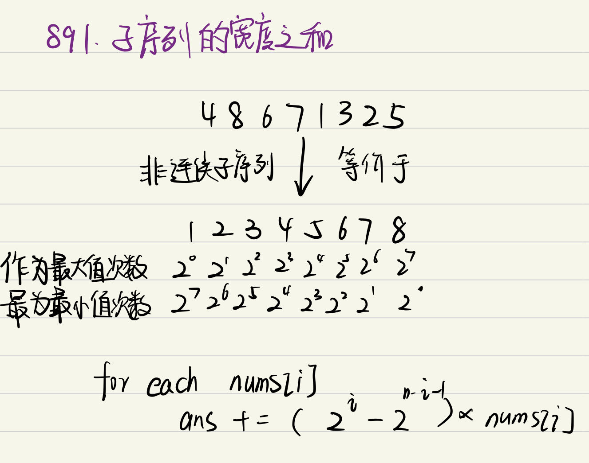

# 891. 子序列宽度之和
一个序列的 **宽度** 定义为该序列中最大元素和最小元素的差值。

给你一个整数数组 $nums$ ，返回 $nums$ 的所有非空 **子序列** 的 **宽度之和** 。由于答案可能非常大，请返回对 $10^9 + 7$ 取余 后的结果。

**子序列** 定义为从一个数组里删除一些（或者不删除）元素，但不改变剩下元素的顺序得到的数组。例如，$[3,6,2,7]$ 就是数组 $[0,3,1,6,2,2,7]$ 的一个子序列。

**示例1**
>**输入**：nums = [2,1,3]
**输出**：6
**解释**：子序列为 `[1], [2], [3], [2,1], [2,3], [1,3], [2,1,3]` 。
相应的宽度是 `0, 0, 0, 1, 1, 2, 2` 。
宽度之和是 `6`

**数据范围**
$1 <= nums.length <= 10^5$
$1 <= nums[i] <= 10^5$

## 思路 


## CODE
``` CPP
typedef long long ll;
class Solution {
public:
    int sumSubseqWidths(vector<int>& nums) {
        int mod = 1e9+7, n = nums.size();
        sort(nums.begin(), nums.end());
        vector<ll> index(n, 1);
        for(int i = 1; i < n; i++)
        {
            index[i] = (2*index[i-1])%mod;
        }
        int ans = 0;
        for(int i = 0; i < n; i++)
        {
            ans = (ans + (index[i] - index[n-i-1])*nums[i]) % mod;
        }
        return ans;
    }
};
```
