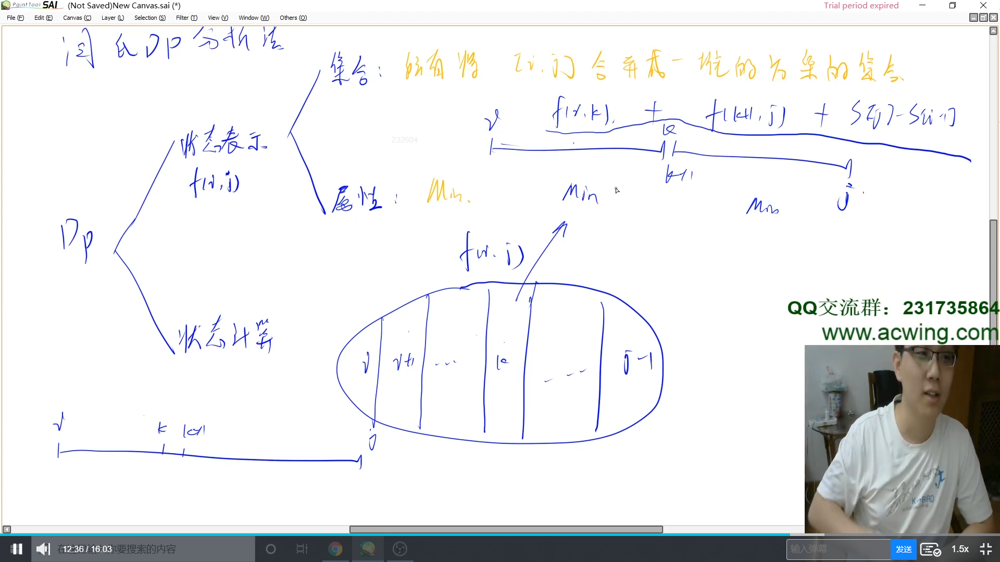
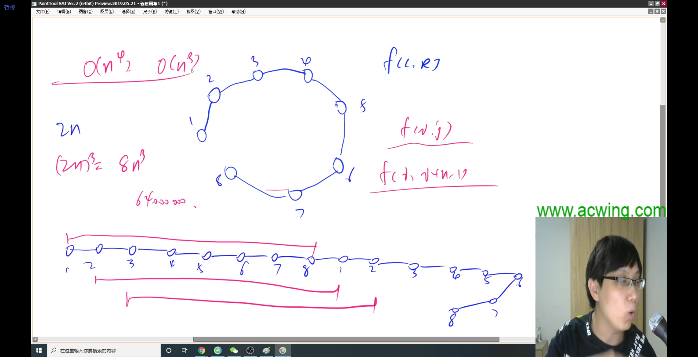
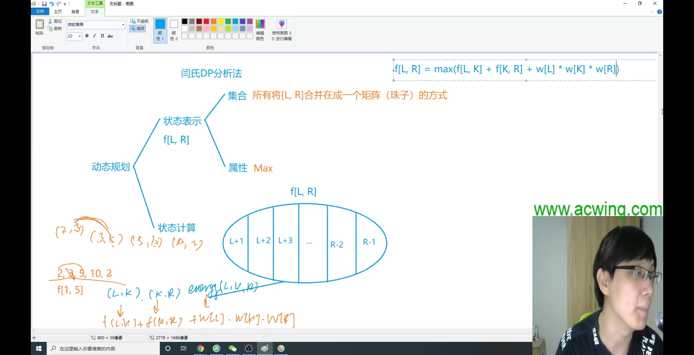
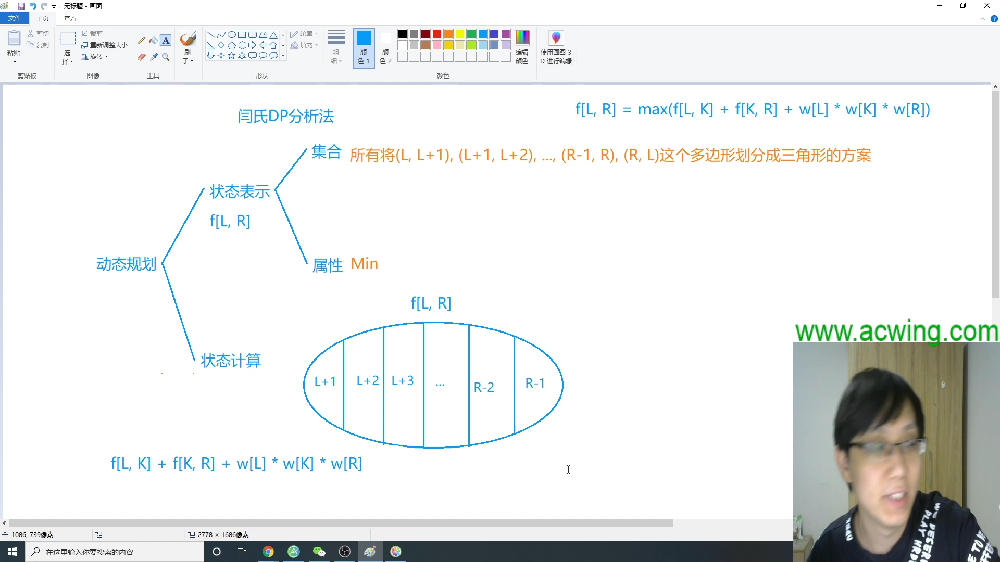
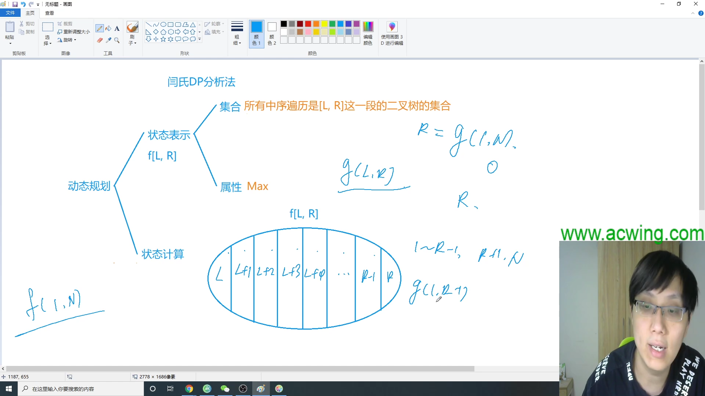
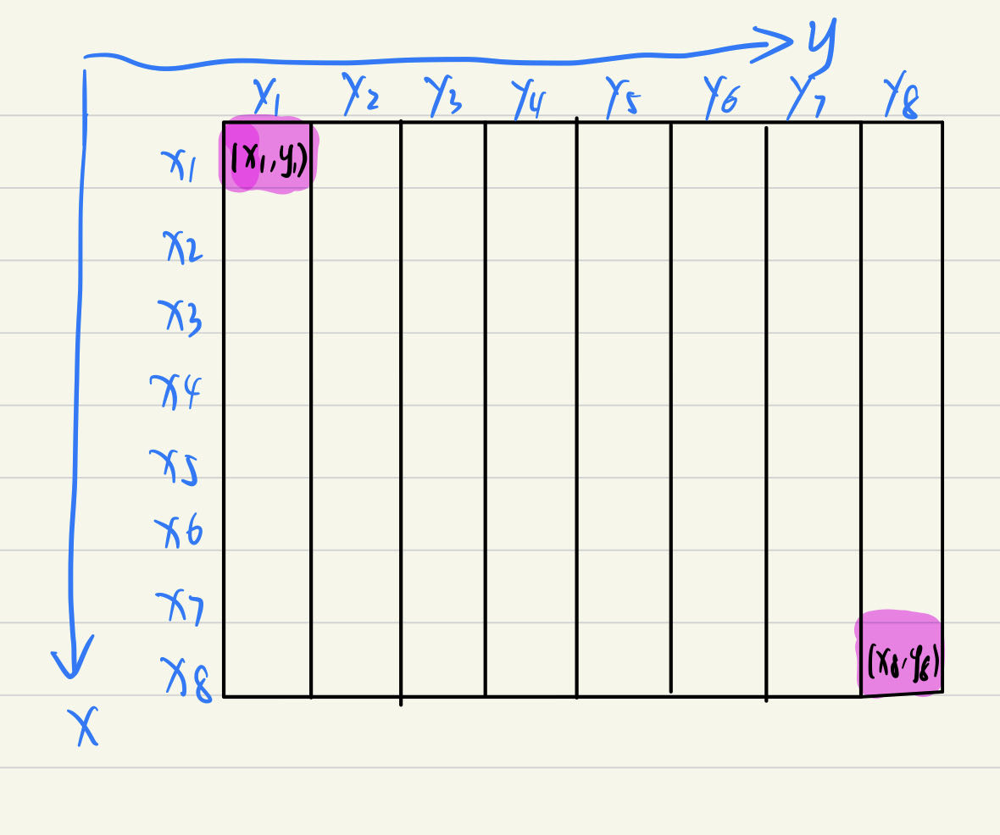
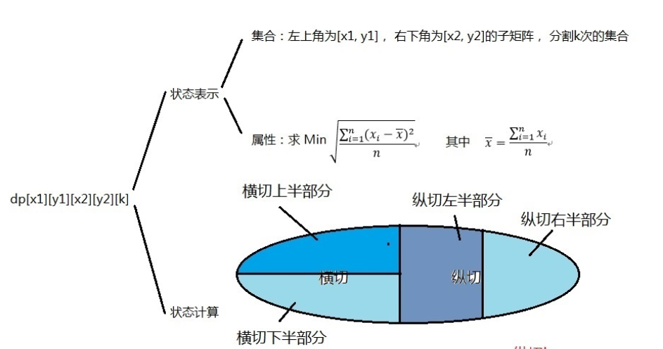

# 区间Dp
[toc]
## 石子合并问题

设有 $N$ 堆石子排成一排，其编号为 `1，2，3，…，N`。

每堆石子有一定的质量，可以用一个整数来描述，现在要将这 `N` 堆石子合并成为一堆。

每次只能合并相邻的两堆，合并的代价为这两堆石子的质量之和，合并后与这两堆石子相邻的石子将和新堆相邻，合并时由于选择的顺序不同，合并的总代价也不相同。

例如有 `4` 堆石子分别为` 1  3 5 2`， 我们可以先合并 `1 2` 堆，代价为 `4`，得到 `4 5 2`， 又合并 `1 2` 堆，代价为 `9`，得到 `9 2` ，再合并得到 `11`，总代价为 `4+9+11=24`；

如果第二步是先合并 `2 3` 堆，则代价为 `7`，得到 `4 7`，最后一次合并代价为 `11`，总代价为 `4+7+11=22`。

问题是：找出一种合理的方法，使总的代价最小，输出最小代价。

**输入格式**
第一行一个数 $N$ 表示石子的堆数 $N$。

第二行 $N$ 个数，表示每堆石子的质量(均不超过 1000)。

**输出格式**
1 ≤ $N$ ≤ 300

**输入样例：**
>4
1 3 5 2

**输出样例：**
>22

### 思路


**区间DP枚举模板**
```cpp
for (int len = 1; len <= n; len++) {         // 区间长度
    for (int i = 1; i + len - 1 <= n; i++) { // 枚举起点
        int j = i + len - 1;                 // 区间终点
        if (len == 1) {
            dp[i][j] = 初始值
            continue;
        }

        for (int k = i; k < j; k++) {        // 枚举分割点，构造状态转移方程
            dp[i][j] = min(dp[i][j], dp[i][k] + dp[k + 1][j] + w[i][j]);
        }
    }
}
```
### CODE
```cpp []
#include <iostream>
#include <cstring>
using namespace std;

const int N = 305;
int s[N], f[N][N], n;
int main()
{
    memset(f, 0x3f, sizeof(f));
    cin >> n;
    for(int i = 1; i <= n; i++)
    {
        int w;
        cin >> w;
        s[i] = w + s[i-1];
    }

    for(int len = 1; len <= n; len++)
    {
        for(int i = 1; i + len-1 <= n; i++)//i+len-1 为区间终点
        {
            int j = i + len-1;
            if(i == j) f[i][j] = 0;
        

            for(int k = i; k+1 <= j; k++)
            {
                f[i][j] = min(f[i][j], f[i][k] + f[k+1][j] + s[j] - s[i-1]);
            }
        }
    }

    cout << f[1][n] << endl;

    return 0;
}
```
## [NOI1995]环形石子合并


在一个圆形操场的四周摆放 $N$ 堆石子，现要将石子有次序地合并成一堆，规定每次只能选相邻的 $2$ 堆合并成新的一堆，并将新的一堆的石子数，记为该次合并的得分。

试设计出一个算法,计算出将 $N$ 堆石子合并成 $1$ 堆的最小得分和最大得分。

**输入格式**

数据的第 $1$ 行是正整数 $N$，表示有 $N$ 堆石子。

第 $2$ 行有 $N$ 个整数，第 $i$ 个整数 $a_i$ 表示第 $i$ 堆石子的个数。

**输出格式**

输出共 $2$ 行，第 $1$ 行为最小得分，第 $2$ 行为最大得分。


**样例输入**
```
4
4 5 9 4
```

**样例输出** 

```
43
54
```

**提示**

$1\leq N\leq 100$，$0\leq a_i\leq 20$。

### 思路


### CODE
```cpp
#include <iostream>
#include <cstring>

using namespace std;

const int N = 105;
int f[2*N][2*N], g[2*N][2*N], s[2*N], w[N];

int main()
{
    int n;
    cin >> n;
    memset(f, 0x3f, sizeof(f));
    memset(g, -0x3f, sizeof(g));

    for(int i = 1; i <= 2*n; i++)
    {
        if(i <= n)
        {
            cin >> w[i];
            s[i] = s[i-1] + w[i];
        }
        else
        {
            s[i] = s[i-1] + w[i-n];
        }
    }
    for(int len = 1; len <= n; len++)
    {
        for(int i = 1; i + len - 1 <= 2*n; i++)
        {
            int j = i + len - 1;
            if(i == j)
            {
                f[i][j] = 0;
                g[i][j] = 0;
                continue;
            }

            for(int k = i; k + 1 <= j; k++)
            {
                f[i][j] = min(f[i][j], f[i][k] + f[k+1][j] + s[j] - s[i-1]);
                g[i][j] = max(g[i][j], g[i][k] + g[k+1][j] + s[j] - s[i-1]);
            }
        }
    }

    int minnum = f[1][n], maxnum = g[1][n];
    for(int i = 1; i <= n; i++)
    {
        minnum = min(minnum, f[i][i+n-1]);
        maxnum = max(maxnum, g[i][i+n-1]);
    }
    
    cout << minnum << endl << maxnum;
    return 0; 
}
```
## 能量项链
在$Mars$ 星球上，每个 $Mars$ 人都随身佩带着一串能量项链，在项链上有 $N$ 颗能量珠。
能量珠是一颗有头标记与尾标记的珠子，这些标记对应着某个正整数。
并且，对于相邻的两颗珠子，前一颗珠子的尾标记一定等于后一颗珠子的头标记。
因为只有这样，通过吸盘（吸盘是 $Mars$ 人吸收能量的一种器官）的作用，这两颗珠子才能聚合成一颗珠子，同时释放出可以被吸盘吸收的能量。
如果前一颗能量珠的头标记为 $m$，尾标记为 $r$，后一颗能量珠的头标记为 $r$，尾标记为$ n $，则聚合后释放的能量为 $m×r×n$（$Mars$ 单位），新产生的珠子的头标记为 $m$，尾标记为 $n$。

需要时，$Mars$ 人就用吸盘夹住相邻的两颗珠子，通过聚合得到能量，直到项链上只剩下一颗珠子为止。

显然，不同的聚合顺序得到的总能量是不同的，请你设计一个聚合顺序，使一串项链释放出的总能量最大。

例如：设 $N=4$，$4$ 颗珠子的头标记与尾标记依次为 $(2，3)(3，5)(5，10)(10，2)$。

我们用记号 $⊕$ 表示两颗珠子的聚合操作，$(j⊕k)$ 表示第 $j，k$ 两颗珠子聚合后所释放的能量。则

第 $4、1$ 两颗珠子聚合后释放的能量为：$(4⊕1)=10×2×3=60$。

这一串项链可以得到最优值的一个聚合顺序所释放的总能量为 $((4⊕1)⊕2)⊕3)=10×2×3+10×3×5+10×5×10=710$。

**输入格式**
输入的第一行是一个正整数 $N$，表示项链上珠子的个数。

第二行是 $N$ 个用空格隔开的正整数，所有的数均不超过 $1000$，第 $i$ 个数为第 $i$ 颗珠子的头标记，当 $i < N$ 时，第 $i$ 颗珠子的尾标记应该等于第 $i+1$ 颗珠子的头标记，第 $N$ 颗珠子的尾标记应该等于第 $1$ 颗珠子的头标记。

至于珠子的顺序，你可以这样确定：将项链放到桌面上，不要出现交叉，随意指定第一颗珠子，然后按顺时针方向确定其他珠子的顺序。

**输出格式**
输出只有一行，是一个正整数 $E$，为一个最优聚合顺序所释放的总能量。

**数据范围**
$4$≤$N$≤$100$,
$1$≤$E$≤$2.1×10^9$

**输入样例：**
>4
2 3 5 10

**输出样例：**
>710

### 思路
**把合并$n$颗珠子的问题转化为合并$（n+1）$个数合并的问题，只不过有一个数是公用的，注意不要间断
分割区间长度为 $n+1$**


### CODE

``` cpp
#include <iostream>
#include <cstring>

using namespace std;

const int N = 105;
int f[2*N][2*N], s[2*N];

int main()
{
    memset(f,-0x3f, sizeof(f));
    int n;
    cin >> n;
    for(int i = 1; i <= n; i++)
    {
         cin >> s[i];
         s[i + n] = s[i];
    }

    for(int len = 2; len <= n+1; len++)//区间长度为n+1
    {
        for(int i = 1; i + len - 1 <= 2*n; i++)
        {
            int j = i + len - 1;
            if(len == 2)//最小首尾单元
            {
                f[i][j] = 0;
                continue;
            }

            for(int k = i+1; k < j; k++)
            {
                f[i][j] = max(f[i][j], f[i][k] + f[k][j] + s[i]*s[k]*s[j]);
            }
        }
    }

    int ans = f[1][1+n];
    for(int i = 1; i + n<=2*n; i++)
    {
        ans = max(ans, f[i][i+n]);
    }

    cout << ans;
    return 0;
}
```
## 1069. 凸多边形的划分

给定一个具有 $N$ 个顶点的凸多边形，将顶点从 $1$ 至 $N$ 标号，每个顶点的权值都是一个正整数。

将这个凸多边形划分成 $N−2 $个互不相交的三角形，对于每个三角形，其三个顶点的权值相乘都可得到一个权值乘积，试求所有三角形的顶点权值乘积之和至少为多少。

**输入格式**
第一行包含整数 $N$，表示顶点数量。

第二行包含 $N $个整数，依次为顶点 $1$ 至顶点 $N$ 的权值。

**输出格式**
输出仅一行，为所有三角形的顶点权值乘积之和的最小值。

**数据范围**
N≤50,
数据保证所有顶点的权值都小于$10^9$

**输入样例：**
>5
121 122 123 245 231
1
2

**输出样例：**
>12214884

### 思路

### CODE
```cpp
#include <iostream>
#include <cstring>

using namespace std;

const int N = 55;
int f[N][N], s[N];

int main()
{
    int n;
    cin >> n;

    for(int i = 1; i <= n; i++)
    {
        cin >> s[i];
    }
    
    for(int len = 3; len <= n; len++)
    {
        for(int i = 1; i + len -1 <= n; i++)
        {
            int j = i + len -1;
            f[i][j] = 0x3f3f3f3f;
            for(int k = i+1; k < j; k++)
            {
                f[i][j] = min(f[i][j], f[i][k] + f[k][j] + s[i]*s[k]*s[j]);
            }
        }
    }

    cout << f[1][n];
    return 0;
}
```

**高精度计算**
此题数据量需要使用高精度计算解决
```cpp
#include <iostream>
#include <cstring>
#include <vector>

using namespace std;

const int N = 55;

vector<int> f[N][N], s[N];

typedef long long LL;
// 高精度比较
bool cmp(vector<int> A, vector<int> B)
{
    if(B.size() == 0) return true;
    if(A.size() != B.size()) return A.size() < B.size();
    for(int i = A.size() - 1; i >= 0; i--)
    {
        if(A[i] != B[i]) return A[i] < B[i];
    }
    return true;
}
// 高精度加法
vector<int> add(vector<int> A, vector<int> B)
{
    if(A.size() < B.size()) return add(B, A);
    vector<int> c;
    int t = 0;
    for(int i = 0; i < (int)A.size(); i++)
    {
        t += A[i];
        if(i < (int)B.size()) t += B[i];
        c.push_back(t % 10);
        t /= 10;
    }
    while(t) c.push_back(t % 10), t /= 10;
    return c;
}
// 高精度乘法
vector<int> mul(vector<int> a, vector<int> b)
{
    vector<int> c(a.size()+b.size(), 0);
    for(int i = 0; i < (int)a.size(); i++)
    {
        for(int j = 0; j < (int)b.size(); j++)
        {
            c[i + j] += a[i] * b[j];
        }
    }
    
    int t = 0;
    for(int i = 0; i < (int)c.size(); i++)
    {
        t += c[i];
        c[i] = t % 10;
        t /= 10;
    }

    while(c.size() > 1 && c.back() == 0) c.pop_back();
    return c;
}

int main()
{
    int n;
    cin >> n;

    for(int i = 1; i <= n; i++)
    {
        int t;
        cin >> t;
        while(t)
        {
            s[i].push_back(t % 10);
            t /= 10;
        }
    }

    for(int len = 3; len <= n; len++)
    {
        for(int i = 1; i +len -1 <= n; i++)
        {
            int j = i +len -1;
            for(int k = i+1; k < j; k++)
            {
                vector<int> w = mul(s[i], mul(s[k], s[j]));
                vector<int> c = add(f[i][k], add(f[k][j], w));
                if(cmp(c,f[i][j])) f[i][j] = c;
            }
        }
    }

    for(int i = f[1][n].size()-1; i >= 0; i--)
    {
        cout << f[1][n][i];
    }
    return 0;
}
```

## 479. 加分二叉树

设一个 $n$ 个节点的二叉树 tree 的中序遍历为$（1,2,3,…,n）$，其中数字 $1,2,3,…,n$ 为节点编号。

每个节点都有一个分数（均为正整数），记第 $i$ 个节点的分数为 $i$，tree 及它的每个子树都有一个加分，任一棵子树 subtree（也包含 tree 本身）的加分计算方法如下：     

subtree的左子树的加分 × subtree的右子树的加分 ＋ subtree的根的分数 

若某个子树为空，规定其加分为 $1$。

叶子的加分就是叶节点本身的分数，不考虑它的空子树。

试求一棵符合中序遍历为$（1,2,3,…,n）$且加分最高的二叉树 tree。

**要求输出**

（1）tree的最高加分 

（2）tree的前序遍历
**输入格式**
第 1 行：一个整数 $n$，为节点个数。 

第 2 行：$n$ 个用空格隔开的整数，为每个节点的分数（$0$<分数<$100$）

**输出格式**
第 1 行：一个整数，为最高加分（结果不会超过int范围）。     

第 2 行：n 个用空格隔开的整数，为该树的前序遍历。如果存在多种方案，则输出字典序最小的方案。

**数据范围**
>n<30

**输入样例：**
>5
5 7 1 2 10

**输出样例：**
>145
3 1 2 4 5

### 思路



### CODE

```CPP
#include <iostream>
#include <cstring>

using namespace std;

const int N = 30;

//f[i][j] 所有中序遍历是[L,R]这一段二叉树的集合的最大能量
//f[i][j] 中序遍历是[L,R]这一段二叉树最大能量的根节点
int f[N][N], g[N][N], s[N];

void dfs(int l, int r)
{
    if(l > r) return;
    cout << g[l][r] <<" ";
    dfs(l, g[l][r]-1);//与题目（1，2，3，···，n)中序遍历条件相对
    dfs(g[l][r]+1, r);
}

int main()
{
    int n;
    cin >> n;
    for(int i = 1; i <= n; i++)
    {
        cin >> s[i];
    }

    for(int len = 1; len <= n; len++)
    {
        for(int i = 1; i+len-1 <= n; i++)
        {
            int j = i+len-1;
            if(i == j)
            {
                f[i][j] = s[i];
                g[i][j] = i;
                continue;
            }

            for(int k = i; k <= j; k++)
            {
                int left = k == i ? 1 : f[i][k-1];
                int right = k == j ? 1 : f[k+1][j];
                int score = left * right + s[k];
                if(f[i][j] < score)//字典序最小意味根节点尽可能靠前
                {
                    f[i][j] = score;
                    g[i][j] = k;
                }
            }
        }
    }

    cout << f[1][n] << endl;
    dfs(1,n);
    return 0;
}
```
## [NOI1999] 棋盘分割

将一个 8 $\times$ 8 的棋盘进行如下分割：将原棋盘割下一块矩形棋盘并使剩下部分也是矩形，再将剩下的部分继续如此分割，这样割了 $(n-1)$ 次后，连同最后剩下的矩形棋盘共有 $n$ 块矩形棋盘。 (每次切割都只能沿着棋盘格子的边进行)


原棋盘上每一格有一个分值，一块矩形棋盘的总分为其所含各格分值之和。现在需要把棋盘按上述规则分割成 $n$ 块矩形棋盘，并使各矩形棋盘总分的均方差最小。


均方差 $\sigma = \sqrt{ \frac{ \sum_{i=1}^n (x_i - \bar x)^2 } { n }}$                ，其中平均值 $\bar x = \frac{\sum_{i=1}^n x_i}{n}$ ,  $x_i$ 为第 $i$ 块矩形棋盘的分。


请编程对给出的棋盘及 $n$ ，求出 $\sigma$ 的最小值。

**输入格式**

第一行为一个整数 $n$ ($ 1 < n< 15 $)。


第二行至第九行每行为 $8$ 个小于 $100$ 的非负整数，表示棋盘上相应格子的分值。每行相邻两数之间用一个空格分隔。

**输出格式**

仅一个数，为 $\sigma$ （四舍五入精确到小数点后三位）。


**样例输入**
```
3
1 1 1 1 1 1 1 3
1 1 1 1 1 1 1 1
1 1 1 1 1 1 1 1
1 1 1 1 1 1 1 1
1 1 1 1 1 1 1 1
1 1 1 1 1 1 1 1
1 1 1 1 1 1 1 0
1 1 1 1 1 1 0 3
```
**样例输出** 

```
1.633
```

### 思路
**注意棋盘的划分**



### CODE
``` cpp
#include <iostream>
#include <cstring>

using namespace syd;
const int N = 9, INF = 0x3f3f3f3f;

int n , m = 8, s[N][N];
double f[N][N][N][N], X;

//二维前缀和
int get_sum(int x1, int y1, int x2, int y2)
{
    return s[x2][y2] - s[x2][y1-1] - s[x1-1][y2]+s[x1-1][y1-1];
}

//均方差公式
double get(int x1, int y1, int x2, int y2)
{
    double sum = get_sum(x1, y1, x2, y2) - X;
    return sum * sum / n;
}

//记忆化搜索
double dfs(int x1, int y1, int x2, int y2, int k)
{
    double &v = f[x1][y1][x2][y2][k];
    if(v >= 0) return v;
    if(k == 1) return v = get(x1, y1, x2, y2);

    v = INF;

    //横着切
    for(int i = x1; i < x2; i++)
    {
        //放弃上半部分(死值)，选择下半部分(记忆化搜索)
        v = min(v, get(x1,y1,i,y2) + dfs(i+1, y1, x2, y2, k-1));
        //选择上半部分
        v = min(v, get(i+1,y1,x2,y2) + dfs(x1, y1, i, y2, k-1));
    }

    //竖着切
    for(int i = y1; i < y2; i++)
    {
        //选择左半部分
        v = min(v, get(x1, i+1, x2, y2)+dfs(x1, y1, x2, i, k-1));
        //选择右半部分
        v = min(v, get(x1, y1, x2, i)+dfs(x1, i+1, x2, i, k-1))
    }

    return v;
}

int main()
{
    cin >> n;
    //构建二维数组前缀和
    for(int i = 1; i <= m; i++)
    {
        for(int j = 1; j <= m; j++)
        {
            cin >> s[i][j];
            s[i][j] += s[i-1][j] + s[i][j-1] - s[i-1][j-1];
        }
    }

    X = (double) s[m][m] / n;
    memset(f, -0x3f, sizeof(f));

    printf("%.3lf\n", sqrt(dfs(1,1,8,8,n-1)));
    return 0;
}