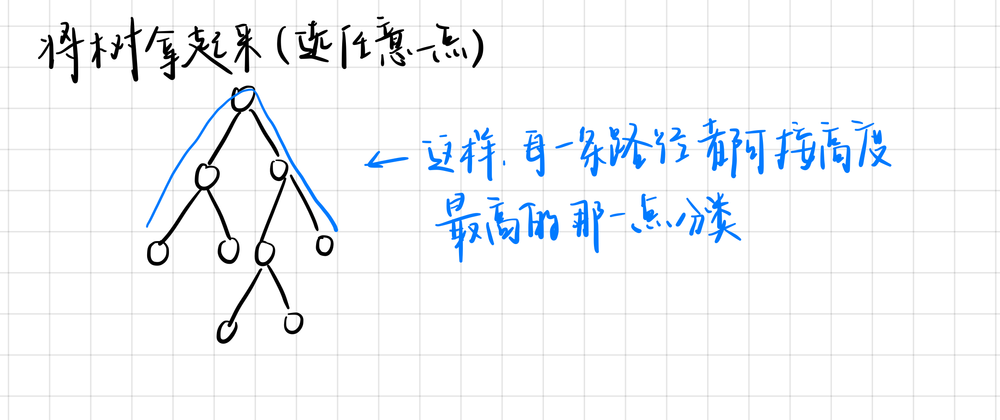
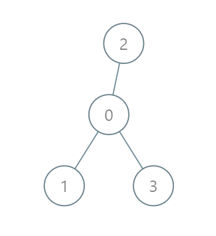

# 树形Dp

## 树的最长路径


给定一棵树，树中包含 $n$ 个结点（编号$1 $~$ n$  ）和 $n$ 条无向边，每条边都有一个权值。

现在请你找到树中的一条最长路径。

换句话说，要找到一条路径，使得使得路径两端的点的距离最远。

注意：路径中可以只包含一个点。

**输入格式**

第一行包含整数 $n$。

接下来 $n−1$ 行，每行包含三个整数 $a_{i},b_{i},c_{i}$，表示点 $a_{i}$ 和 $b_{i}$ 之间存在一条权值为 $c_{i}$ 的边。

输出格式 输出一个整数，表示树的最长路径的长度。

**输出格式**

输出一个整数，表示树的最长路径的长度

**数据范围**

$1≤n≤10000$
$1≤ai$,$bi≤n$ 
$−10^5≤ci≤10^5$
**样例输入**

```
6
5 1 6
1 4 5
6 3 9
2 6 8
6 1 7
```

**样例输出** 
```
22
```
### 思路
找树的直径的方法
1. 任取一点作为起点，找出离该点距离最远的点 $u$ ,再找到离$u$最远的一点 $v$ **<font color="#dd0000">[只适用于非负权边长]</font><br />**


2. 把这些树的直径分成若干类，使得分类唯一，在每一类中求最大值,**以通过每个节点分类**


### CODE
**两次寻找做法**
```cpp
#include <iostream>
#include <cstring>
#include <algorithm>

using namespace std;

const int N = 10010, M = 2*N;
int e[M], ne[M], w[M], h[N], record[N], idx;

void add(int a,int b, int c)
{
    e[idx] = b, ne[idx] = h[a], w[idx] = c, h[a] = idx++;
}

int dfs(int u, int father)
{
    int dist = 0;
    for(int i = h[u]; i != -1; i = ne[i])
    {
        int j = e[i];
        if(j == father) continue;
        int d = dfs(j, u) + w[i];
        if(d > dist)
        {
            dist = d;
            record[u] = j;
        }
    }
    return dist;
}
int main()
{
    int n;
    cin >> n;
    
    memset(h, -1, sizeof(h));
    memset(record, -1, sizeof(record));

    for(int i = 0; i < n-1; i++)
    {
        int a, b, c;
        cin >> a >> b >> c;
        add(a, b, c), add(b, a, c);
    }

    int newhead = 1;

    dfs(1, -1);
    while(record[newhead] > 0)
    {
        newhead = record[newhead];
    }
    cout << dfs(newhead, -1);
    return 0;
}
```

```cpp
#include <iostream>
#include <cstring>
#include <algorithm>

using namespace std;

const int N = 10010, M = 2*N;

int n;
int h[N], e[M], ne[M], w[M], idx;
int ans;

void add(int a, int b, int c)
{
    e[idx] = b, w[idx] = c, ne[idx] = h[a], h[a] = idx++;
}
/*h数组的下标是当前节点的标号，值是当前结点第一条边的编号（其实是最后加入的那一条边），e数组是边的集合，它的下标是当前边的编号，数值是当前边的终点；
ne是nextedge，如果ne是-1表示当前结点没有下一条边，ne的下标是当前边的编号，数值是当前结点的下一条边的编号，idx用于保存每一条边的上一条边的编号。
这样我们就知道了当前结点的第一条边是几，这个边的终点是那个结点，该节点的下一条边编号是几，那么邻接表就完成了
*/ 
int dfs(int u, int father)
{
    int dist = 0;
    int d1 = 0, d2 = 0;
    for(int i = h[u]; ~i; i = ne[i])
    {
        int j = e[i];
        if(j == father) continue;
        int d = dfs(j, u) + w[i];
        dist = max(dist, d);

        if(d >= d1) d2 = d1, d1 = d;
        else if(d > d2) d2 = d;
    }

    ans = max(ans, d1 + d2);

    return dist;
}
int main()
{
    cin >> n;
    memset(h, -1, sizeof(h));
    for(int i = 0; i < n-1; i++)
    {
        int a, b, c;
        cin >> a >> b >> c;
        add(a, b, c), add(b, a, c);
    }

    dfs(1, -1);
    cout << ans;
    return 0; 
}
```

## 6243. 到达首都的最少油耗
给你一棵 $n$ 个节点的树（一个无向、连通、无环图），每个节点表示一个城市，编号从 0 到 $n - 1$ ，且恰好有 $n - 1$ 条路。0 是首都。给你一个二维整数数组 $roads$ ，其中 $roads[i]$ = $[a_{i}, b_{i}]$ ，表示城市 $a_{i}$ 和 $b_{i}$ 之间有一条 **双向路** 。

每个城市里有一个代表，他们都要去首都参加一个会议。

每座城市里有一辆车。给你一个整数 $seats$ 表示每辆车里面座位的数目。

城市里的代表可以选择乘坐所在城市的车，或者乘坐其他城市的车。相邻城市之间一辆车的油耗是一升汽油。

请你返回到达首都最少需要多少升汽油。
**示例1**

>**输入：roads** = [[0,1],[0,2],[0,3]], seats = 5
**输出**：3
**解释**：
代表 1 直接到达首都，消耗 1 升汽油。
代表 2 直接到达首都，消耗 1 升汽油。
代表 3 直接到达首都，消耗 1 升汽油。
最少消耗 3 升汽油。

**数据范围**
$1 <= n <= 10^5$
$roads.length == n - 1$
$roads[i].length == 2$
$0 <= a_{i}, b_{i} < n$
$a_{i} != b{i}$
$roads$ 表示一棵合法的树。
$1 <= seats <= 10^5$
### 思路
**解法：贪心 & 统计每条边的贡献**
首先注意到一个关键结论：所有车只往根节点移动。
证明：如果一辆车 $c$ 要往深度更深的节点$u$ 去接人，不如从 $u$ 开出一辆车与 $c$ 会合。因为$c$去$u$接人还得开回去，而从 $u$ 出发的车不必回到 $u$，显然油耗更低。

一条边 $u \to v$ （设 $u$ 是 $v$ 的父节点）的贡献就是以 $v$ 为根的子树中有几辆车经过了这条边，答案就是所有边的贡献之和。
设以 $v$ 为根的子树中共有 $s_{v}$个节点，显然至少需要 $\lceil \frac{s_v}{\text{seats}} \rceil$  ($\lceil \rceil$**向上取整**) 
用 DFS 统计以每个点为根的子树中有几个节点。复杂度 $\mathcal{O}(n)$。


### CODE
```CPP
class Solution {
public:
    long long ans = 0;
    int seat;
    int dfs(int u, int father)//得到来u节点人数
    {
        int dist = 1;
        for(auto j : edges[u])
        {
            if(j == father) continue;
            int person = dfs(j, u);
            ans += (person + seat - 1)/seat;
            dist += person;
        }
        return dist;
    }

    long long minimumFuelCost(vector<vector<int>>& roads, int seats) {
        seat = seats;
        int n = roads.size();
        vector<vector<int>> edges(n+1, vector<int>());

        //建图
        for(int i = 0; i < n; i++)
        {
            edges[roads[i][0]].push_back(roads[i][1]);
            edges[roads[i][1]].push_back(roads[i][0]);
        }

        //树状dfs
        dfs(0, -1);
        return ans;
    }
};
```

## 1073. 树的中心
给定一棵树，树中包含 n 个结点（编号1~n）和 n−1 条无向边，每条边都有一个权值。

请你在树中找到一个点，使得该点到树中其他结点的最远距离最近。

**输入格式**
第一行包含整数 n。

接下来 $n−1$ 行，每行包含三个整数 $a_{i}$,$b_{i}$,$c_{i}$，表示点 ai 和 bi 之间存在一条权值为 $c_{i}$ 的边。

**输出格式**
输出一个整数，表示所求点到树中其他结点的最远距离。

**数据范围**
$1≤n≤10000$,
$1≤a_{i},b_{i}≤n$,
$1≤ c_{i} ≤10^5$
**输入样例：**
>5 
2 1 1 
3 2 1 
4 3 1 
5 1 1

**输出样例：**
>2

### 思路
这个问题是**树形DP**中的一类经典模型，常被称作**换根DP**

同样，先来想一下如何暴力求解该问题：先**枚举**目标节点，然后求解该节点到其他节点的 **最远距离**

时间复杂度为 $O(n^2)$，对于本题的 数据规模，十分极限，经测试只能过 6/10

考虑如何优化求解该问题的方法
思考一下：在确定树的 **拓扑结构** 后单独求一个节点的 **最远距离** 时，会在该树上去比较哪些 **路径** 呢？

1. 从当前节点往下，直到子树中某个节点的最长路径
2. 从当前节点往上走到其父节点，再从其父节点出发且不回到该节点的最长路径

**换根DP** 一般分为三个步骤：

1. 指定任意一个根节点
2. 一次dfs遍历，统计出当前子树内的节点对当前节点的贡献
3. 一次dfs遍历，统计出当前节点的父节点对当前节点的贡献，然后合并统计答案
那么我们就要先 **dfs** 一遍，预处理出当前子树对于根的**最大贡献（距离）**和 **次大贡献（距离）**

处理 **次大贡献（距离）** 的原因是：

如果 **当前节点** 是其 **父节点子树** 的 **最大路径** 上的点，则 **父节点子树** 的** 最大贡献** 不能算作对该节点的贡献

因为我们的路径是 **简单路径**，不能 **走回头路**

然后我们再 **dfs** 一遍，求解出每个节点的父节点对他的贡献（即每个节点往上能到的最远路径两者比较，取一个 **max** 即可

### CODE
```cpp
#include <iostream>
#include <cstring>
#include <algorithm>

using namespace std;

const int N = 10010, M = 2*N;
int h[N], e[M], ne[M], w[M], idx;
int d1[N], d2[N], up[N], fd1[N];

void add(int a, int b, int c)
{
    e[idx] = b, w[idx] = c, ne[idx] = h[a], h[a] = idx++;
}

int dfs(int u, int father)
{
    for(int i = h[u]; i != -1; i = ne[i])
    {
        int j = e[i];
        if(j == father) continue;
        int d = dfs(j, u) + w[i];
        if(d > d1[u])
        {
            d2[u] = d1[u];
            d1[u] = d;
            fd1[u] = j;
        }
        else if(d > d2[u])
        {
            d2[u] = d;
        }
    }
    return d1[u];
}

void dfs_up(int u, int father)
{
    for(int i = h[u]; i != -1; i = ne[i])
    {
        int j = e[i];
        if(j == father) continue;
        if(fd1[u] == j) up[j] = max(up[u], d2[u]) + w[i];
        else up[j] = w[i] + max(up[u], d1[u]);
        dfs_up(j, u);    
    }
}

int main()
{
    int n, ans = 0x3f3f3f3f;
    cin >> n;
    memset(h, -1, sizeof(h));
    
    for(int i = 0; i < n-1; i++)
    {
        int a, b, c;
        cin >> a >> b >> c;
        add(a, b, c), add(b, a, c);
    }
    
    dfs(1, -1);
    dfs_up(1, -1);

    for(int i = 1; i <= n; i++)
    {
        ans = min(max(up[i], d1[i]), ans);
    }
    cout << ans << endl;
    return 0;
}
```

