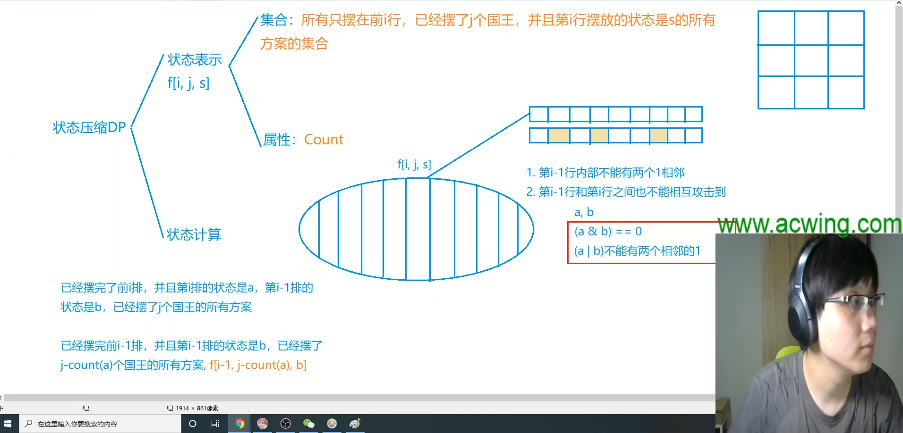
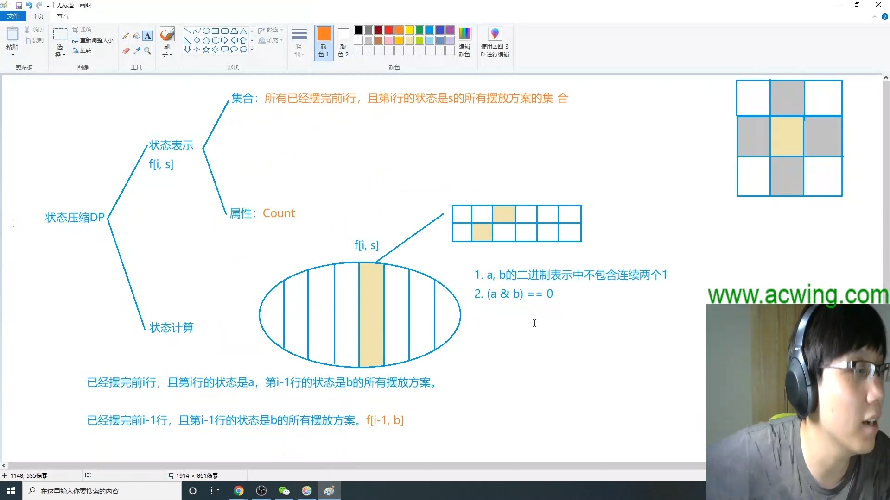
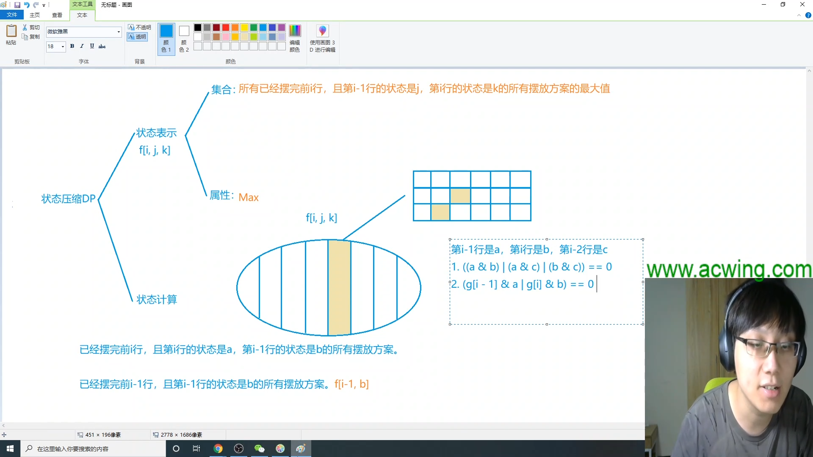

# 状态压缩dp

包括**两类** ： 
1. 棋盘式（基于连通性）
2. 集合
   
##  1. 棋盘式（基于连通性）
### 1.1 P1896 [SCOI2005] 互不侵犯


#### 题目描述

在N×N的棋盘里面放K个国王，使他们互不攻击，共有多少种摆放方案。国王能攻击到它上下左右，以及左上左下右上右下八个方向上附近的各一个格子，共8个格子。

注：数据有加强（2018/4/25）

#### 输入格式

只有一行，包含两个数N，K （ 1 <=N <=9, 0 <= K <= N \* N）

#### 输出格式

所得的方案数

#### 样例 #1

#### 样例输入 #1

```
3 2
```

#### 样例输出 #1

```
16
```

#### 闫氏Dp分析法



#### 代码

``` cpp
#include <cstring>
#include <iostream>
#include <algorithm>
#include <vector>

using namespace std;

typedef long long LL;

const int N = 12, M = 1 << 10, K = 110;

int n, m;
vector<int> state;
int cnt[M];
vector<int> head[M];
LL f[N][K][M];

bool check(int state)//检查state是否合法
{
    for(int i = 0; i < n; i++)
    {
        if((state >> i & 1) && (state >> i+1 & 1))//条件一 每行内部不能相邻
            return false;
    }
    return true;
}

int count(int state)//计算状态内有多少个1
{
    int res = 0;
    for(int i = 0; i < n; i++) res += state >> i & 1;
    return res;
}

int main()
{
    cin >> n >> m;
    
    for(int i = 0; i < 1 << n; i++)
    {
        if(check(i))//将合法状态记录
        {
            state.push_back(i);
            cnt[i] = count(i);
        }
    }

    for(int i = 0; i < state.size(); i++)
    {
        for(int j = 0; j < state.size(); j++)
        {
            int a = state[i], b = state[j];
            if((a & b) == 0 && check(a | b))
            {
                head[i].push_back(j);//state[i] 状态可以转移到 state[j] 状态
            }
        }
    }

    f[0][0][0] = 1;//初始状态 即正摆0行用了0个棋子状态是0的方案数为1
    for(int i = 1; i <= n + 1; i++)//多加一轮 便于输出
    {
        for(int j = 0; j <= m; j++)
        {
            for(int a = 0; a < state.size(); a++)
            {
                for(int b : head[a])
                {
                    int c = cnt[state[a]];
                    if(j >= c) f[i][j][a] += f[i-1][j-c][b];
                }
            }
        }
    }


    cout << f[n+1][m][0] << endl;

    return 0;

     
}

```


### 1.2 AcWing 327. 玉米田


#### 题目描述

农夫约翰的土地由 M×N 个小方格组成，现在他要在土地里种植玉米。

非常遗憾，部分土地是不育的，无法种植。

而且，相邻的土地不能同时种植玉米，也就是说种植玉米的所有方格之间都不会有公共边缘。

现在给定土地的大小，请你求出共有多少种种植方法。

土地上什么都不种也算一种方法。

#### 输入格式

第 1 行包含两个整数 M 和 N。

第 2..M+1 行：每行包含 N 个整数 0 或 1，用来描述整个土地的状况，1 表示该块土地肥沃，0 表示该块土地不育。


#### 输出格式

输出总种植方法对 10\^8 取模后的值。

#### 数据范围

1≤M,N≤12。

#### 样例 #1

#### 样例输入 #1

```
2 3
1 1 1
0 1 0
```

#### 样例输出 #1

```
9
```

#### 闫氏Dp分析法


#### 代码

```cpp
#include <iostream>
#include <vector>
#include <algorithm>

using namespace std;

const int N = 14, M = 1 << 12, mod = 1e8;

int n,m;
int g[N];//原有地图记录
vector<int> state;
vector<int> head[M];//可以从 M 状态开始转移的状态集合 
int f[N][M];

bool check(int state)
{
    for(int i = 0; i < m; i++)
    {
        if((state >> i & 1) && (state >> i+1 & 1)) return false;
    }
    return true;
}

int main()
{
    cin >> n >> m;
    for(int i = 1; i <= n; i++)
    {
        for(int j = 0; j < m; j++)
        {
            int t;
            cin >> t;
            g[i] += !t << j;//原有地图记录（原有1代表能播种，需转换为0，反之亦然）
        }
    }

    for(int i = 0; i < 1 << m; i++)
    {
        if(check(i)) state.push_back(i);//所有不相邻播种状态
    }

    for(int i = 0; i < state.size(); i++)
    {
        for(int j = 0; j < state.size(); j++)
        {
            int a = state[i], b = state[j];
            if((a & b) == 0)
                head[i].push_back(j);//所有不相邻播种状态
        }
    }

    f[0][0] = 1;
    for(int i = 1; i <= n+1; i++)
    {
        for(int a = 0; a < state.size(); a++)
        {
            for(int b : head[a])
            {
                if(g[i] & state[a]) continue;//贫瘠土地
                f[i][a] = (f[i][a] + f[i-1][b]) % mod;
            }
        }
    }

    cout << f[n+1][0] << endl;//多进行一轮

    return 0;
}

```


### 1.3[NOI2001] 炮兵阵地

#### 题目描述

司令部的将军们打算在 $N\times M$ 的网格地图上部署他们的炮兵部队。

一个 $N\times M$ 的地图由 $N$ 行 $M$ 列组成，地图的每一格可能是山地（用 $\texttt{H}$ 表示），也可能是平原（用 $\texttt{P}$ 表示），如下图。

在每一格平原地形上最多可以布置一支炮兵部队（山地上不能够部署炮兵部队）；一支炮兵部队在地图上的攻击范围如图中黑色区域所示：

  

如果在地图中的灰色所标识的平原上部署一支炮兵部队，则图中的黑色的网格表示它能够攻击到的区域：沿横向左右各两格，沿纵向上下各两格。

图上其它白色网格均攻击不到。从图上可见炮兵的攻击范围不受地形的影响。

现在，将军们规划如何部署炮兵部队，在防止误伤的前提下（保证任何两支炮兵部队之间不能互相攻击，即任何一支炮兵部队都不在其他支炮兵部队的攻击范围内），在整个地图区域内最多能够摆放多少我军的炮兵部队。

#### 输入格式

第一行包含两个由空格分割开的正整数，分别表示 $N$ 和 $M$。

接下来的 $N$ 行，每一行含有连续的 $M$ 个字符，按顺序表示地图中每一行的数据。

#### 输出格式

一行一个整数，表示最多能摆放的炮兵部队的数量。

#### 样例 #1

#### 样例输入 #1

```
5 4
PHPP
PPHH
PPPP
PHPP
PHHP
```

#### 样例输出 #1

```
6
```

#### 提示

对于 $100\%$ 的数据，$N\le 100$，$M\le 10$，保证字符仅包含 `P` 与 `H`。

#### 闫氏dp分析法



#### 代码

``` cpp
#include <iostream>
#include <cstring>
#include <algorithm>
#include <vector>

using namespace std;

const int N = 11, M = 1 << 10;

int n, m;
int g[110];
vector<int> state,head[M];
int cnt[M];
int f[2][M][M];


bool check(int state)//判断合法状态
{
    for(int i = 0; i < m; i++)
    {
        if((state >> i & 1) && ((state >> i + 1 & 1) || (state >> i+2 & 1)))//均不相邻
            return false;
    }
    return true;
}

int count (int state)//得到炮台个数
{
    int res = 0;
    for(int i = 0; i < m; i++) res += state >> i & 1;
    return res; 
}

int main()
{
    cin >> n >> m;
    for(int i = 1; i <= n; i++)//画地图
    {
        for(int j = 0; j < m; j++)
        {
            char c; 
            cin >> c;
            if(c == 'H') g[i] += 1 << j;
        }
    }

    for(int st = 0; st < 1 << m; ++st)//得到所有合法状态
    {
        if(check(st))
            state.push_back(st), cnt[st] = count(st);
    }

    for(int cur : state)
    {
        for(int pre : state)
        {
            if(!(cur & pre))//前后两行不并行
                head[cur].push_back(pre);
        }
    }

    for(int i = 1; i <= n+2; ++i)//得到前n+2行数据
    {
        for(int st : state)
        {
            if(!(g[i] & st))
            {
                for(int p1 : head[st])
                {
                    for(int p2 : head[p1])
                    {
                        if(!(st & p2))//隔行不并行
                        {
                            f[i & 1][st][p1] = max(f[i & 1][st][p1] , f[i-1 & 1][p1][p2] + cnt[st]);//滚动数组优化
                        }
                    }
                }
            }
        }
    }

    cout << f[n+2 &1][0][0];//输出
    return 0;
}
```

##  2. 集合

### 2.1 AcWing 91.最短Hamilton距离
给定一张 n 个点的带权无向图，点从 0∼n−1 标号，求起点 0 到终点 n−1 的最短 Hamilton 路径。

Hamilton 路径的定义是从 0 到 n−1 不重不漏地经过每个点恰好一次。

#### 输入格式
第一行输入整数 n。

接下来 n 行每行 n 个整数，其中第 i 行第 j 个整数表示点 i 到 j 的距离（记为 a[i,j]）。

对于任意的 x,y,z，数据保证 a[x,x]=0，a[x,y]=a[y,x] 并且 a[x,y]+a[y,z]≥a[x,z]。

#### 输出格式
输出一个整数，表示最短 Hamilton 路径的长度。

#### 数据范围

1≤n≤20
0≤a[i,j]≤107

#### 输入样例：
```
5
0 2 4 5 1
2 0 6 5 3
4 6 0 8 3
5 5 8 0 5
1 3 3 5 0
```
#### 输出样例：
```
18
```
#### 闫氏Dp分析法


#### 代码
```cpp
#include <iostream>
#include <cstring>

using namespace std;

const int N = 20, M = 1 << N;
int f[M][N], w[N][N];

int main()
{
    int n;
    cin >> n;
    for(int i = 0; i < n; i++)
    {
        for(int j = 0; j < n; j++)
        {
            cin >> w[i][j];//输入权重
        }
    }

    memset(f, 0x3f, sizeof(f));//属性min 需要初始化max
    f[1][0] = 0;//起始点
    for(int i = 1; i < 1 << n; i++)
    {
        for(int j = 0; j < n; j++)//遍历是f[i][j]
        {
            if(i >> j & 1)// i里有j的情况
                for(int k = 0; k < n; k++)
                {
                    if(i - (1 << j) >> k & 1)// 去掉j后 k需要仍在
                        f[i][j] = min(f[i][j], f[i - (1 << j)][k] + w[k][i]);
                }
        }
    }

    cout << f[(1 << n) - 1][n-1] << endl;//输出结果
    return 0;
}


```