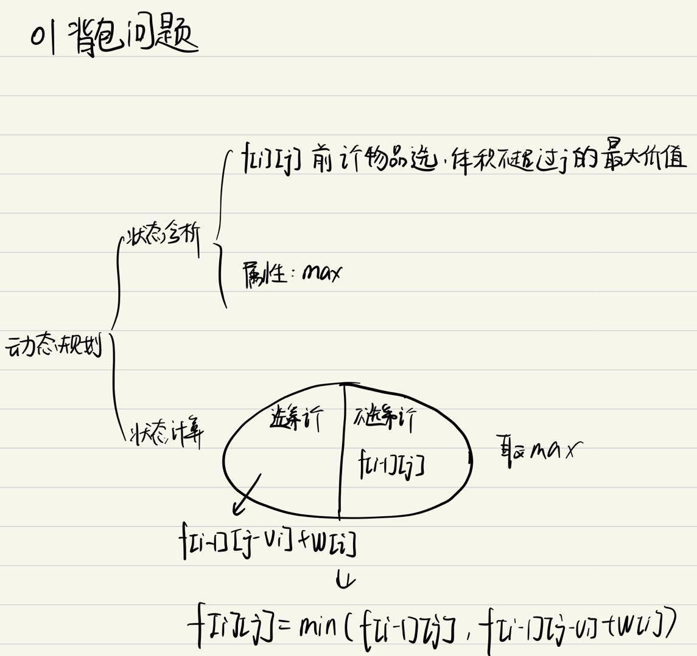
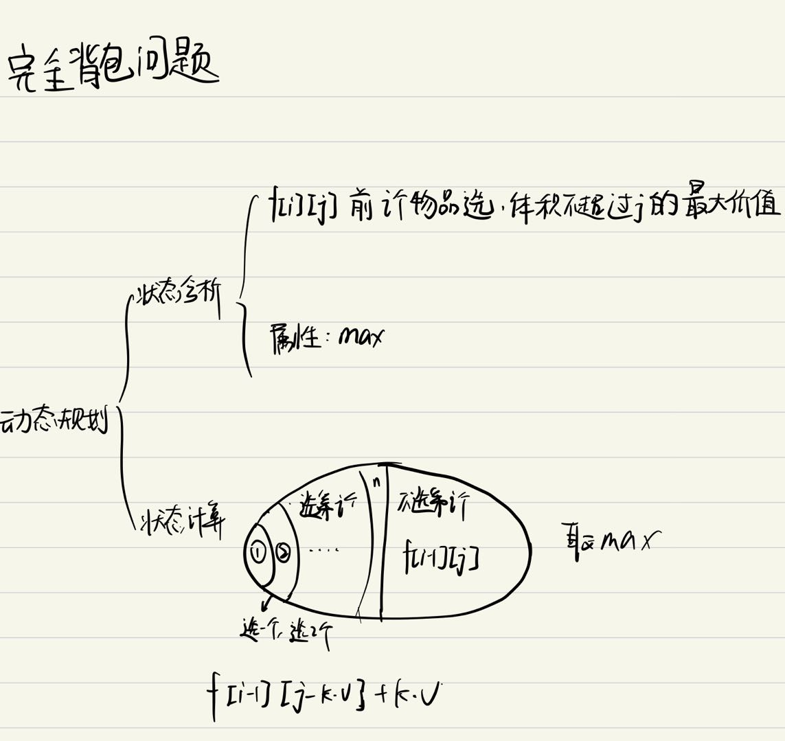
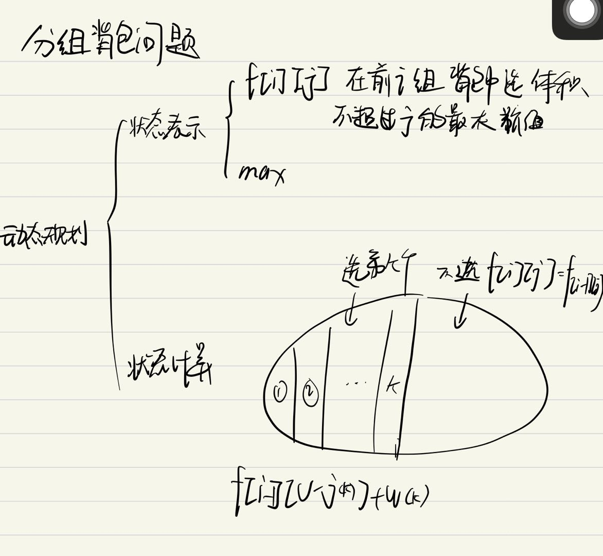
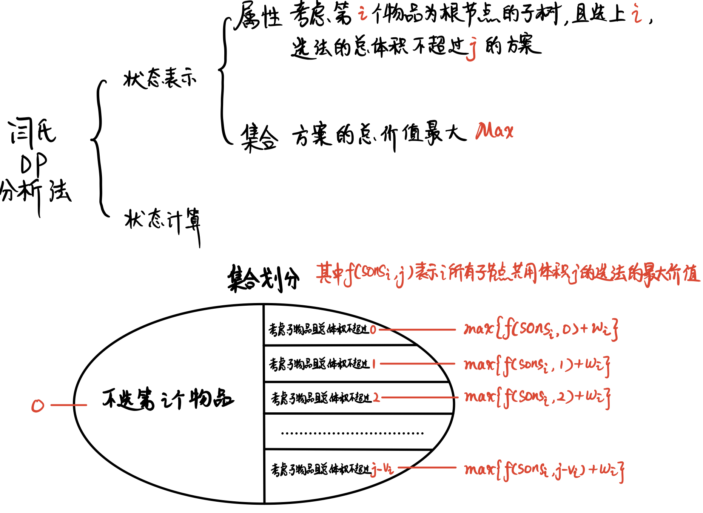

# 背包问题

[toc]
## 01背包问题
有 $N$ 件物品和一个容量是 $V$ 的背包。每件物品只能使用一次。
第 $i$ 件物品的体积是 $vi$，价值是 $wi$。

求解将哪些物品装入背包，可使这些物品的总体积不超过背包容量，且总价值最大。
输出最大价值。

### 输入格式
第一行两个整数，$N$，$V$，用空格隔开，分别表示物品数量和背包容积。

接下来有 $N$ 行，每行两个整数 $vi$, $wi$，用空格隔开，分别表示第 $i$ 件物品的体积和价值。

**输出格式**
输出一个整数，表示最大价值。

**数据范围**
0< $N$,$V$ ≤1000
0< $vi$, $wi$ ≤1000
**输入样例**
>  4 5
1 2
2 4
3 4
4 5

**输出样例：**
> 8

### 思路
闫氏dp分析法


### 代码

```cpp
#include <iostream>
#include <cstring>

using namespace std;

const int N = 1010, V = 1010;
int f[N][V], w[N], v[N];

int main()
{
    int n, m;
    cin >> n >> m;
    for(int i = 1; i <= n; i++)
    {
        cin >> v[i] >> w[i];
        for(int j = 0; j <= m; j++)
        {
            f[i][j] = f[i-1][j];
            if(j >= v[i]) f[i][j] = max(f[i][j], f[i-1][j-v[i]] + w[i]);
        }
    }

    cout << f[n][m] << endl;
    return 0; 
}
```

**动态规划代码优化都可看作对初始代码的等价变形**  
因为只用到$[i-1]$ $[i]$ 两层，故可以优化一层状态
```cpp
#include <iostream>
#include <cstring>

using namespace std;

const int N = 1010, V = 1010;
//int f[N][V], w[N], v[N];
int f[V], w[N], v[N];//减少1层状态
int main()
{
    int n, m;
    cin >> n >> m;
    for(int i = 1; i <= n; i++)
    {
        cin >> v[i] >> w[i];
        for(int j = m; j >= v[i]; j--)//对于[i-1] -> [i] 需要从后往前遍历
        {
            //f[j] = f[j]; 恒等式
             f[j] = max(f[j], f[j-v[i]] + w[i]);
        }
    }

    cout << f[m] << endl;
    return 0; 
}
```

## 完全背包问题
有 $N$ 种物品和一个容量是 $V$ 的背包，每种物品都有无限件可用。

第 $i$ 种物品的体积是 $vi$，价值是 $wi$。

求解将哪些物品装入背包，可使这些物品的总体积不超过背包容量，且总价值最大。
输出最大价值。

**输入格式**
第一行两个整数，$N$，$V$，用空格隔开，分别表示物品种数和背包容积。

接下来有 N 行，每行两个整数 $vi$,$wi$，用空格隔开，分别表示第 $i$ 种物品的体积和价值。

**输出格式**
输出一个整数，表示最大价值。

**数据范围**
0<$N$ , $V$ ≤ 1000
0<$vi$ , $wi$ ≤1000
**输入样例**
>4 5
1 2
2 4
3 4
4 5

**输出样例：**
>10

### 思路
闫氏dp分析法


### 代码
```cpp
#include <iostream>
#include <cstring>

using namespace std;

const int N = 1010, V = 1010;
int f[N][V], w[N], v[N];

int main()
{
    int n, m;
    cin >> n >> m;
    for(int i = 1; i <= n; i++)
    {
        cin >> v[i] >> w[i];
        for(int j = 0; j <= m; j++)
        {
            f[i][j] = f[i-1][j];
            for(int k = 1; k*v[i] <= j; k++)
            {
                f[i][j] = max(f[i][j], f[i-1][j-k*v[i]] + k*w[i]);
            }
            
        }
    }

    cout << f[n][m] << endl;
    return 0; 
}
```
**优化思路**
>$f[i , j ]$ = max( $f[i-1,j]$ , $f[i-1,j-v]$+$w$ ,  $f[i-1,j-2*v]$+$2*w$ , $f[i-1,j-3*v]$+$3*w$ , .....)
$f[i , j-v]$= max(            $f[i-1,j-v]$   ,  $f[i-1,j-2*v]$ +$ w$ , $f[i-1,j-3*v]+2*w$ , .....)
由上两式，可得出如下递推关系： 
                        $f[i][j]=max(f[i,j-v]+w , f[i-1][j])$ 

**有了上面的关系，那么其实k循环可以不要了，核心代码优化成这样**

>for(int i = 1 ; i <=n ;i++)
for(int j = 0 ; j <=m ;j++)
{
    f[i][j] = f[i-1][j];
    if(j-v[i]>=0)
        f[i][j]=max(f[i][j],f[i][j-v[i]]+w[i]);
}


```cpp
#include <iostream>
#include <cstring>

using namespace std;

const int N = 1010, V = 1010;
int f[V], w[N], v[N];

int main()
{
    int n, m;
    cin >> n >> m;
    for(int i = 1; i <= n; i++)
    {
        cin >> v[i] >> w[i];
        for(int j = v[i]; j <= m; j++)//[i] -> [i] 需要从前往后遍历
        {
            f[j] = max(f[j], f[j-v[i]] + w[i]);          
        }
    }

    cout << f[m] << endl;
    return 0; 
}
```

## 多重背包问题
有 $N$ 种物品和一个容量是 $V$ 的背包。

第 $i$ 种物品最多有 $si$ 件，每件体积是 $vi$，价值是 $wi$。

求解将哪些物品装入背包，可使物品体积总和不超过背包容量，且价值总和最大。
输出最大价值。

**输入格式**
第一行两个整数，$N$，$V$，用空格隔开，分别表示物品种数和背包容积。

接下来有 $N$ 行，每行三个整数 $vi$,$wi$,$si$，用空格隔开，分别表示第 $i$ 种物品的体积、价值和数量。

**输出格式**
输出一个整数，表示最大价值。

**数据范围**
>0< $N$,$V$≤100
0<$vi$,$wi$,$si$≤100

**输入样例**
>4 5
1 2 3
2 4 1
3 4 3
4 5 2

 **输出样例：**
>10

### 思路 
闫氏Dp分析法

有限制的完全背包问题

### 代码
```cpp
#include <iostream>
#include <cstring>

using namespace std;

const int N = 105, V = 105;
int f[N][V], w[N], v[N], s[N];

int main()
{
    int n, m;
    cin >> n >> m;
    for(int i = 1; i <= n; i++)
    {
        cin >> v[i] >> w[i] >> s[i];
        for(int j = 0; j <= m; j++)
        {
            f[i][j] = f[i-1][j];
            for(int k = 1; k*v[i] <= j && k <= s[i]; k++)
            {
                f[i][j] = max(f[i][j], f[i-1][j-k*v[i]] + k*w[i]);
            }
            
        }
    }

    cout << f[n][m] << endl;
    return 0; 
}
```
**时间复杂度** **$n*v*s$**
在此题数据范围内可以解出
下面解法主要是对时间复杂度进行优化

**优化一**
s个物品可分为$1，2，4，8，2^n,··· ,s - 2^n$个物品包 然后将每类物品的，都可化为01背包问题
```cpp
#include <iostream>
#include <cstring>

using namespace std;

const int N = 20000, V = 2010;//N = v*logs
int f[V], w[N], v[N], s[N];

int main()
{
    int n, m;
    cin >> n >> m;
    int cnt = 0;
    //展开为背包问题
    for(int i = 1; i <= n; i++)
    {
        int a,b,count = 1;
        cin >> a >> b >> s[i];
        while(count <= s[i])
        {
            v[cnt] = count * a;
            w[cnt] = count * b;
            s[i] -= count;
            count *=2;
            cnt++;
        }
        if(s[i])
        {
            v[cnt] = s[i] * a;
            w[cnt] = s[i] * b;
            cnt++;
        }
    }

    for(int i = 0; i < cnt; i++)
    {
        for(int j = m; j >= v[i]; j--)
        { 
            f[j] = max(f[j-1]+w[i], f[j]);
        }
    }
    cout << f[m];
    return 0; 
}
```
**优化二**


>dp[i][j] 表示将前 i 种物品放入容量为 j 的背包中所得到的最大价值
dp[i][j] = max(不放入物品 i，放入1个物品 i，放入2个物品 i, ... , 放入k个物品 i)
这里 k 要满足：k <= s, j - k * v >= 0
不放物品  i = dp[i-1][j]
放k个物品 i = dp[i-1][j - k * v] + k * w
dp[i][j] = max(dp[i-1][j], dp[i-1][j-v] + w, dp[i-1][j-2*v] + 2*w,..., dp[i-1][j-k*v] + k*w)

>实际上我们并不需要二维的dp数组，适当的调整循环条件，我们可以重复利用dp数组来保存上一轮的信息
我们令 dp[j] 表示容量为j的情况下，获得的最大价值
那么，针对每一类物品 i ，我们都更新一下 dp[m] --> dp[0] 的值，最后 dp[m] 就是一个全局最优值
dp[m] = max(dp[m], dp[m-v] + w, dp[m-2*v] + 2*w, dp[m-3*v] + 3*w, ...)
接下来，我们把 dp[0] --> dp[m] 写成下面这种形式
dp[0], dp[v],   dp[2*v],   dp[3*v],   ... , dp[k*v]
dp[1], dp[v+1], dp[2*v+1], dp[3*v+1], ... , dp[k*v+1]
dp[2], dp[v+2], dp[2*v+2], dp[3*v+2], ... , dp[k*v+2]
...
dp[j], dp[v+j], dp[2*v+j], dp[3*v+j], ... , dp[k*v+j]

>显而易见，m 一定等于 k*v + j，其中  0 <= j < v
所以，我们可以把 dp 数组分成 j 个类，每一类中的值，都是在同类之间转换得到的
也就是说，dp[k*v+j] 只依赖于 { dp[j], dp[v+j], dp[2*v+j], dp[3*v+j], ... , dp[k*v+j] }
因为我们需要的是{ dp[j], dp[v+j], dp[2*v+j], dp[3*v+j], ... , dp[k*v+j] } 中的最大值，
可以通过维护一个单调队列来得到结果。这样的话，问题就变成了 j 个单调队列的问题

>所以，我们可以得到
dp[j]    =     dp[j]
dp[j+v]  = max(dp[j] +  w,  dp[j+v])
dp[j+2v] = max(dp[j] + 2w,  dp[j+v] +  w, dp[j+2v])
dp[j+3v] = max(dp[j] + 3w,  dp[j+v] + 2w, dp[j+2v] + w, dp[j+3v])
...
但是，这个队列中前面的数，每次都会增加一个 w ，所以我们需要做一些转换

>dp[j]    =     dp[j]
dp[j+v]  = max(dp[j], dp[j+v] - w) + w
dp[j+2v] = max(dp[j], dp[j+v] - w, dp[j+2v] - 2w) + 2w
dp[j+3v] = max(dp[j], dp[j+v] - w, dp[j+2v] - 2w, dp[j+3v] - 3w) + 3w
...
这样，每次入队的值是 dp[j+k*v] - k*w

>单调队列问题，最重要的两点
1）维护队列元素的个数，如果不能继续入队，弹出队头元素
2）维护队列的单调性，即：尾值 >= dp[j + k*v] - k*w
本题中，队列中元素的个数应该为 s+1 个，即 0 -- s 个物品 i

**个人理解**
```cpp
for (int j = 0; j < v; ++j) {
            int head = 0, tail = -1;
            for (int k = j; k <= m; k += v) {

                if (head <= tail && k - s*v > q[head])
                    ++head;

                while (head <= tail && pre[q[tail]] - (q[tail] - j)/v * w <= pre[k] - (k - j)/v * w)
                    --tail;

                if (head <= tail)
                    dp[k] = max(dp[k], pre[q[head]] + (k - q[head])/v * w);

                q[++tail] = k;
            }
}
```
关键是采用取模手段分为j个单调队列进行操作
---

### 代码
```cpp
#include <iostream>
#include <cstring>

using namespace std;

const int N = 20010;

int dp[N], pre[N], q[N];
int n, m;

int main() {
    cin >> n >> m;
    for (int i = 0; i < n; ++i) {
        memcpy(pre, dp, sizeof(dp));
        int v, w, s;
        cin >> v >> w >> s;
        for (int j = 0; j < v; ++j) {
            int head = 0, tail = -1;
            for (int k = j; k <= m; k += v) {

                if (head <= tail && k - s*v > q[head])
                    ++head;

                while (head <= tail && pre[q[tail]] - (q[tail] - j)/v * w <= pre[k] - (k - j)/v * w)
                    --tail;

                if (head <= tail)
                    dp[k] = max(dp[k], pre[q[head]] + (k - q[head])/v * w);

                q[++tail] = k;
            }
        }
    }
    cout << dp[m] << endl;
    return 0;
}
```
---

## 混合背包问题
有 $N$ 种物品和一个容量是 $V$ 的背包。

物品一共有三类：

第一类物品只能用1次（01背包）；
第二类物品可以用无限次（完全背包）；
第三类物品最多只能用 $si$ 次（多重背包）；
每种体积是 $vi$，价值是 $wi$。

求解将哪些物品装入背包，可使物品体积总和不超过背包容量，且价值总和最大。
输出最大价值。

**输入格式**
第一行两个整数，$N$，$V$，用空格隔开，分别表示物品种数和背包容积。

接下来有 $N$ 行，每行三个整数 $vi$,$wi$,$si$，用空格隔开，分别表示第 $i$ 种物品的体积、价值和数量。

$si=−1$ 表示第 $i$ 种物品只能用1次；
$si=0$ 表示第 $i$ 种物品可以用无限次；
$si>0$ 表示第 $i$ 种物品可以使用 si 次；
**输出格式**
输出一个整数，表示最大价值。

**数据范围**
0< $N$,$V$ ≤1000
0<$vi$, $wi%$≤1000
−1≤$si$≤1000
**输入样例**
4 5
1 2 -1
2 4 1
3 4 0
4 5 2
**输出样例：**
8

### 思路
**闫氏Dp分析法**

见01背包，完全背包，多重背包问题

此题考虑分为两类 01背包（将完全背包展开为01背包） + 多重背包

### 代码
```cpp
#include<iostream>

using namespace std;

const int N = 10010, M = 1010;
int f[M], v[N], w[N], s[N];

int main()
{
    int n, m;
    cin >> n >> m;
    int cnt = 0;
    for(int i = 0; i < n; i++)
    {
        int a, b;
        cin >> a >> b >> s[i];
        if(s[i] > 0 || s[i] == -1)
        {
            if(s[i] == -1) s[i] = 1;
            int count = 1;
            while(count <= s[i])
            {
                v[cnt] = a*count;
                w[cnt] = b*count;
                s[i] -= count;
                count *= 2;
                cnt++;
            }
            if(s[i])
            {
                v[cnt] = s[i]*a;
                w[cnt] = s[i]*b;
                cnt++;
            }
        }
        else
        {
            for(int j = a; j <= m; j++)
            {
                f[j] = max(f[j], f[j-a] + b);
            }
        }
    }

    for(int i = 0; i < cnt; i++)
    {
        for(int j = m; j >= v[i]; j--)
        {
            f[j] = max(f[j], f[j-v[i]] + w[i]);
        }
    }

    cout << f[m];
    return 0;
}

```

## 二维费用的背包问题
有 $N$ 件物品和一个容量是 $V$ 的背包，背包能承受的最大重量是 $M$。

每件物品只能用一次。体积是 $vi$，重量是 $mi$，价值是 $wi$。

求解将哪些物品装入背包，可使物品总体积不超过背包容量，总重量不超过背包可承受的最大重量，且价值总和最大。
输出最大价值。

 **输入格式**
第一行三个整数，$N,V,M$，用空格隔开，分别表示物品件数、背包容积和背包可承受的最大重量。

接下来有 $N$ 行，每行三个整数 $vi,mi,wi$，用空格隔开，分别表示第 $i$ 件物品的体积、重量和价值。

 **输出格式**
输出一个整数，表示最大价值。

 **数据范围**
0< $N$ ≤1000
0< $V,M $≤100
0< $vi,mi $≤100
0<$wi $≤1000
 **输入样例**
>4 5 6
1 2 3
2 4 4
3 4 5
4 5 6
 
 **输出样例：**
>8

### 思路 
闫氏Dp分析法
01背包多一维

### CODE
```cpp
#include <iostream>

using namespace std;

const int N = 1005, V = 105, M = 105;
int f[V][M], v, m, w;
int main()
{
    int n, c, g;
    cin >> n >> c >> g;
    for(int i = 0; i < n; i++)
    {
        cin >> v >> m >> w;
        for(int j = c; j >= v; j--)
        {
            for(int k = g; k >= m; k--)
            {
                f[j][k] = max(f[j][k], f[j-v][k-m] + w);
            }
        }
    }
    cout << f[v][m];
    return 0;
}
```

## 分组背包问题

有 $N$ 组物品和一个容量是 $V$ 的背包。

每组物品有若干个，同一组内的物品最多只能选一个。
每件物品的体积是  v~ij~ ，价值是 w~ij~，其中 $i $是组号，$j$ 是组内编号。

求解将哪些物品装入背包，可使物品总体积不超过背包容量，且总价值最大。

输出最大价值。

 **输入格式**
第一行有两个整数 $N$，$V$，用空格隔开，分别表示物品组数和背包容量。

接下来有 $N$ 组数据：

每组数据第一行有一个整数 S~i~，表示第 $i$ 个物品组的物品数量；
每组数据接下来有 S~i~ 行，每行有两个整数 v~ij~,w~ij~，用空格隔开，分别表示第 $i$ 个物品组的第 $j$ 个物品的体积和价值；
 **输出格式**
输出一个整数，表示最大价值。

 **数据范围**
0< $N,V$ ≤100
0< S~i~ ≤100
0<v~ij~,w~ij~≤100
 **输入样例**
>3 5
2
1 2
2 4
1
3 4
1
4 5

**输出样例：**
>8

### 思路 
闫氏Dp分析法

### CODE
``` cpp
#include <iostream>

using namespace std;

const int N = 105, V = 105;
int f[N][V], w[N][N], v[N][N], s[N];

int main()
{
    int n, c;
    cin >> n >> c;
    for(int i = 1; i <= n; i++)
    {
        cin >> s[i];
        for(int j = 1; j <= s[i]; j++)
        {
            cin >> v[i][j] >> w[i][j];
        }
    }

    for(int i = 1; i <= n; i++)
    {
        for(int j = 0; j <= c; j++)
        {
            f[i][j] = f[i-1][j];
            for(int k = 1; k <= s[i]; k++)
            {
                if(j >= v[i][k])f[i][j] = max(f[i-1][j - v[i][k]]+w[i][k], f[i][j]);
            }
        }
    }

    cout << f[n][c] <<endl;
    return 0;
}
```
**优化**
``` cpp
#include <iostream>

using namespace std;

const int N = 105, V = 105;
int f[V], w[N][N], v[N][N], s[N];

int main()
{
    int n, c;
    cin >> n >> c;
    for(int i = 1; i <= n; i++)
    {
        cin >> s[i];
        for(int j = 1; j <= s[i]; j++)
        {
            cin >> v[i][j] >> w[i][j];
        }
    }

    for(int i = 1; i <= n; i++)
    {
        for(int j = c; j >= 0; j--)
        {
            for(int k = 1; k <= s[i]; k++)
            {
                if(j >= v[i][k])f[i][j] = max(f[j - v[i][k]]+w[i][k], f[j]);
            }
        }
    }

    cout << f[c] <<endl;
    return 0;
}
```

## 有依赖的背包问题

有 $N$ 个物品和一个容量是 $V$ 的背包。

物品之间具有依赖关系，且依赖关系组成一棵树的形状。如果选择一个物品，则必须选择它的父节点。

如下图所示：


如果选择物品5，则必须选择物品1和2。这是因为2是5的父节点，1是2的父节点。

每件物品的编号是 $i$，体积是 $vi$，价值是 $wi$，依赖的父节点编号是 $pi$。物品的下标范围是 $1…N$。

求解将哪些物品装入背包，可使物品总体积不超过背包容量，且总价值最大。

输出最大价值。

**输入格式**
第一行有两个整数 $N，V$，用空格隔开，分别表示物品个数和背包容量。

接下来有 $N$ 行数据，每行数据表示一个物品。
第 $i$ 行有三个整数 $vi,wi,pi$，用空格隔开，分别表示物品的体积、价值和依赖的物品编号。
如果 $pi$ = −1，表示根节点。 数据保证所有物品构成一棵树。

**输出格式**
输出一个整数，表示最大价值。

**数据范围**
1≤$N,V$≤100
1≤$vi,wi$≤100
父节点编号范围：

内部结点：1≤ $pi$ ≤$N$;
根节点 $pi$ =−1;
**输入样例**
>5 7
2 3 -1
2 2 1
3 5 1
4 7 2
3 6 2

**输出样例：**
>11

### 思路
闫氏Dp分析法 
树形dp

### CODE
```cpp
#include <iostream>
#include <cstring>

using namespace std;

const int N = 110;

int n, m, root;
int h[N], e[N], ne[N], idx;
/*h数组的下标是当前节点的标号，值是当前结点第一条边的编号（其实是最后加入的那一条边），e数组是边的集合，它的下标是当前边的编号，数值是当前边的终点；
ne是nextedge，如果ne是-1表示当前结点没有下一条边，ne的下标是当前边的编号，数值是当前结点的下一条边的编号，idx用于保存每一条边的上一条边的编号。
这样我们就知道了当前结点的第一条边是几，这个边的终点是那个结点，该节点的下一条边编号是几，那么邻接表就完成了
*/ 
int v[N], w[N];
int f[N][N];

void add(int a, int b)//将b加到a中构建邻接表
{
    e[idx] = b, ne[idx] = h[a], h[a] = idx++;
}

void dfs(int u)
{
    //先枚举所有状态体积小于等于j-v[u]的所有子节点们能够获得的最大价值
    for(int i = h[u]; ~i; i = ne[i])
    {
        int son = e[i];
        dfs(son);
        for(int j = m-v[u]; j >= 0; j++)
        {
            for(int k = 0; k <= j; k++)
            {
                f[u][j] = max(f[u][j], f[u][j-k] + f[son][k]);
            }
        }
    }
    //最后选上第u件物品
    for(int i = m; i >= v[u]; i++)
    {
        f[u][i] = f[u][i-v[u]] + w[u];
    }
    //清空没选上u的所有状态
    for(int i = 0; i < v[u]; i++)
    {
        f[u][i] = 0;
    }
}

int main()
{
    memset(h, -1, sizeof(h));
    cin >> n >> m;
    for(int i = 1; i <= n; i++)
    {
        int p;
        cin >> v[i] >> w[i] >> p;
        if(p == -1) root;
        else add(p, i);
    }
    dfs(root);
    cout << f[root][m] << endl;
    return 0;
}
```

## 背包问题求方案数
有 $N$ 件物品和一个容量是 $V $的背包。每件物品只能使用一次。

第 $i$ 件物品的体积是 $v_{i}$，价值是 $w_{i}$。

求解将哪些物品装入背包，可使这些物品的总体积不超过背包容量，且总价值最大。

输出 最优选法的方案数。注意答案可能很大，请输出答案模 $10^9+7 $的结果。

**输入格式**
第一行两个整数，$N，V$，用空格隔开，分别表示物品数量和背包容积。

接下来有 $N$ 行，每行两个整数 $vi,wi$，用空格隔开，分别表示第 $i$件物品的体积和价值。

**输出格式**
输出一个整数，表示 方案数 模 $10^9+7$ 的结果。

**数据范围**
0<$N$,$V$≤1000
0<$v_{i}$,$w_{i}$≤1000
**输入样例**
>4 5
1 2
2 4
3 4
4 6

**输出样例：**
>2

### 闫氏dp分析法
两个dp数组：
f[j] 表示背包容积”恰好”为j时的最大价值和 ———— 最优解dp
g[j] 表示背包容积”恰好”为j时取最优解的方案数 ———— 方案数dp
两个数组通过下标j相对应

最后找到最优解的数值，在g[j]里面只要与这个数相等的都是最优方案数

注意：
因为最终不一定占满全部的背包体积，所以最优解不一定是f[m]
01背包在这个地方就不一样了，因为01背包就算占不满m的体积到最后也可以转移到f[m]中，f[m]保留的就是最优解
但是方案数中g[j]严格与f[i]相对应，必须找出准确的取最优解时的体积
注意定义的这个“恰好”

初始化：
g[0]=1;//啥都不选也算一种方案
f[0]=0;

**恰好** 决定了初始化的状态 : **<font color="#dd0000">初始状态与定义等价</font><br />**

### CODE
```CPP
#include <iostream>
#include <cstring>

using namespace std;

const int N = 1005, mod = 1e9+7;

int f[N], g[N];

int main()
{
    int n, m;
    cin >> n >> m;
    memset(f, -0x3f, sizeof(f));
    f[0] = 0；//一个都没装时 只有体积为0合法 最大价值为0 非法状态置-INF
    g[0] = 1;
    for(int i = 1; i <= n; i++)
    {
        int v, w;
        cin >> v >> w;
        for(int j = m; j >= v; j--)
        {
            int cnt = 0;
            int maxw = max(f[j], f[j-v] + w);
            if(f[j] == maxw) cnt += g[j];
            if(f[j-v]+w == maxw) cnt += g[j-v];
            f[j] = maxw;
            g[j] = cnt % mod;
        }
    }
    
    
    int res = 0;
    for(int i = 0; i <= m; i++) res = max(res, f[i]);
    
    int cnt = 0;
    for(int i = 0; i <= m; i++)
    {
        if(res == f[i]) cnt = (cnt + g[i]) % mod;
    }

    cout << cnt;

    return 0;
}
```
## 背包问题求具体方案
有 $N $件物品和一个容量是$ V $的背包。每件物品只能使用一次。

第 $i$ 件物品的体积是 $v_{i}$，价值是 $w_{i}$。

求解将哪些物品装入背包，可使这些物品的总体积不超过背包容量，且总价值最大。

输出 字典序最小的方案。这里的字典序是指：所选物品的编号所构成的序列。物品的编号范围是 $1…N$。

**输入格式**
第一行两个整数，$N，V$，用空格隔开，分别表示物品数量和背包容积。

接下来有 $N$ 行，每行两个整数 $v_{i}$,$w_{i}$，用空格隔开，分别表示第 $i$ 件物品的体积和价值。

**输出格式**
输出一行，包含若干个用空格隔开的整数，表示最优解中所选物品的编号序列，且该编号序列的字典序最小。

物品编号范围是 $1…N$。

**数据范围**
0<$N,V$≤1000
0<$v_{i},w_{i}$≤1000
**输入样例**
>4 5
1 2
2 4
3 4
4 6

**输出样例：**
>1 4

### 思路
所有dp问题都能看成最短路问题
字典序最小->**贪心**
从 1->n 逐步开始判断是否选取
$$ 对第i个判断 = \begin{cases}
只能从第i个状态转移 & 选第i个 \\
不能从第i个状态转移 & 不选第i个 \\
均可 & 选第i个(保证字典序最小)
\end{cases}$$
即能选一定选
### CODE
```CPP
#include <iostream>
#include <cstring>

using namespace std;

const int N = 1010, V = 1010;
int f[N][N], v[N], w[N];

int main()
{
    int n, m;
    cin >> n >> m;
    for(int i = 1; i <= n; i++)
    {
        cin >> v[i] >> w[i];
    }
    
    //配合字典序最小状态转移的方向
    for(int i = n; i >= 1; i--)
    {
        for(int j = 0; j <= m; j++)
        {
            f[i][j] = f[i+1][j];
            if(j >= v[i]) f[i][j]= max(f[i][j], f[i+1][j-v]);
        } 
    }

    int j = v;
    for(int i = 1; i <= n; i++)
    {
        if(j >= v[i] && f[i][v] == f[i+1][j-v[i] + w[i]]) 
        {
            cout << i <<" ";
            j -= v[i];
        }

    }
    
    return 0;
}
